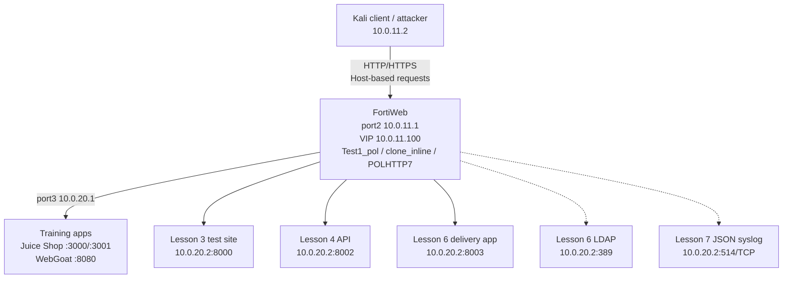

# FortiWeb WAF Security Lab

Hands-on FortiWeb WAF lab built in EVE-NG as an NSE 5/FortiWeb self-study project. The repository documents an incrementally constructed reverse-proxy, application-security, API-security, and application-delivery environment: every lesson keeps the working traffic path and adds another controlled layer to it.

> This is an independent educational lab, not official Fortinet course material. All attack traffic targets deliberately vulnerable applications inside an isolated environment.

## What this repository demonstrates

- Reverse-proxy publishing through a dedicated FortiWeb VIP
- Multiple applications behind one VIP using HTTP `Host`-based content routing
- Load balancing, health checks, source-IP persistence, and `X-Forwarded-For`
- HTTPS offloading at FortiWeb with HTTP between FortiWeb and the backends
- Signature-based and application-aware controls for web traffic
- API contract enforcement for JSON, XML, GraphQL, and OpenAPI traffic
- URL rewriting, LDAP-backed Site Publishing, and cross-host SSO
- Compression, caching, acceleration, Lua response logic, and Waiting Room admission control
- Session-aware and source-IP DoS controls, Layer 3 Fragment Protection, and timed enforcement
- Local Event/Attack/Traffic logging, structured TCP syslog, and sensitive-value masking
- Repeatable positive, negative, and regression tests from a Kali client
- Real troubleshooting notes, including misattachments, port mismatches, session requirements, and trial-license limitations

## Final integrated architecture



FortiWeb exposes one client-side entry point and selects the backend from the request hostname:

| Hostname | Content route | Backend purpose |
| --- | --- | --- |
| `juice.lab.local` | `route_juice` | Juice Shop vulnerability and pool tests |
| `webgoat.lab.local` | `route_webgoat` | WebGoat training application |
| `urlenc.lab.local` | `route_urlenc` | Deterministic Lesson 3 HTML, form, script, DLP, and upload tests |
| `api.lab.local` | `route_api_lesson4` | Deterministic Lesson 4 JSON, XML, GraphQL, JWT, and OpenAPI tests |
| `delivery.lab.local` | `route_delivery_l6` | Lesson 6 rewriting, publishing, performance, scripting, and queue tests |
| `reports.lab.local` | `route_reports_l6` | Second published hostname used to validate SSO |

Lesson 7 added no hostname or protected backend. It reused `delivery.lab.local` for rate/connection tests and `api.lab.local` for controlled sensitive-log payloads; `10.0.20.2` also served as the lab syslog receiver.

Client-side name resolution used in the lab:

```text
10.0.11.100 juice.lab.local webgoat.lab.local urlenc.lab.local api.lab.local delivery.lab.local reports.lab.local
```

## Core network and policy chain

| Component | Lab value |
| --- | --- |
| Kali client | `10.0.11.2/24`, gateway `10.0.11.1` |
| FortiWeb client interface | `port2`, `10.0.11.1/24` |
| FortiWeb VIP | `10.0.11.100` |
| Virtual server | `Vip1` |
| FortiWeb server interface | `port3`, `10.0.20.1/24` |
| Backend Ubuntu/Docker host | `10.0.20.2/24`, gateway `10.0.20.1` |
| Main server policy | `Test1_pol` |
| Deployment mode | HTTP Content Routing |
| Active cloned web protection profile | `clone_inline` |
| Active cloned signature policy | `clone_standard` |

The reusable enforcement chain is:

```text
Test1_pol
  +-- clone_inline (Web Protection Profile)
  |    +-- clone_standard -> custom signature groups/signatures
  |    +-- CSRF, URL encryption, DLP, CORS, input/file controls
  |    +-- JSON, XML, GraphQL, and OpenAPI controls
  |    +-- Lesson 6 URL rewriting, compression, and Waiting Room
  +-- Direct server-policy controls
       +-- POLHTTP7 session/IP rate and connection controls plus fragment protection
       +-- Site Publishing
       +-- Web Cache, acceleration, and Lua scripting
  +-- Global logging
       +-- Local Event, Attack, and Traffic logs
       +-- TCP/JSON syslog and sensitive-data masks
```

This attachment chain matters: creating an object does not enforce it until it is linked into the active profile and the profile is selected by the server policy.

## Lessons

| Lesson | Lab status | Repository write-up | Main outcome |
| --- | --- | --- | --- |
| [01 - Reverse Proxy Foundation](lessons/01-reverse-proxy-foundation/README.md) | Complete | Complete | Dedicated VIP, virtual server, health check, pool, protected hostname, HTTP service, and working Juice Shop reverse proxy |
| [02 - Content Routing and Delivery](lessons/02-content-routing-and-delivery/README.md) | Complete | Complete | Second application, two-host routing, second Juice Shop member, persistence, XFF, IP group, WAF enforcement, and HTTPS offload |
| [03 - Web Application Protection](lessons/03-web-application-protection/README.md) | Complete | Complete | Known/custom signatures, CSRF, URL controls, DLP, headers, CORS, SRI, input validation, hidden fields, file security, and web-shell detection |
| [04 - API Protection](lessons/04-api-protection/README.md) | Complete | Complete | Integrated API backend, JSON/XML/GraphQL/OpenAPI enforcement, JWT flow, method control, and rate limiting |
| [06 - Application Delivery](lessons/06-application-delivery/README.md) | Complete | Complete | Rewriting, LDAP Site Publishing, SSO, compression, caching, acceleration, Lua scripting, and Waiting Room |
| [07 - DoS Protection and Logging](lessons/07-dos-and-logging/README.md) | Complete | Complete | Session/source-IP request and connection controls, fragment protection, local/remote logs, and sensitive-value masking |

The lesson documents are intentionally independent. A reader can stop after any lesson and still have a valid lab state.

## Repository layout

```text
.
├── README.md
├── CHANGELOG.md
├── REPOSITORY_STRUCTURE.md
├── docs/
│   ├── architecture.md
│   ├── object-inventory.md
│   └── troubleshooting-index.md
├── lessons/
│   ├── _template/README.md
│   ├── 01-reverse-proxy-foundation/
│   ├── 02-content-routing-and-delivery/
│   ├── 03-web-application-protection/
│   ├── 04-api-protection/
│   ├── 06-application-delivery/
│   │   ├── README.md
│   │   ├── configs/
│   │   └── evidence/
│   └── 07-dos-and-logging/
│       ├── README.md
│       ├── configs/
│       └── evidence/
├── vuln-sites/
│   ├── juice-shop/
│   ├── webgoat/
│   ├── lesson3-test-site/
│   ├── lesson4-api/
│   └── lesson6-delivery/
├── fortiweb/
│   ├── README.md
│   └── sanitized-objects/
└── scripts/
    ├── client/
    ├── attacks/
    └── validation/
```

See [REPOSITORY_STRUCTURE.md](REPOSITORY_STRUCTURE.md) for ownership rules and the exact files that should accompany each lesson commit.

## How to read a lesson

Each lesson follows the same evidence-first structure:

1. Scope and prerequisite state
2. Architecture delta from the previous lesson
3. Backend files or services added
4. FortiWeb objects and attachment chain
5. Exact configuration sequence
6. Baseline request
7. Attack, negative-control, or capacity-test commands as applicable
8. Observed FortiWeb and backend results
9. Debugging issues and fixes
10. Positive, negative, and regression validation

Use [`lessons/_template/README.md`](lessons/_template/README.md) when publishing another lesson.

## Reproducing the lab

Prerequisites:

- EVE-NG with a FortiWeb virtual appliance available under a valid license or trial
- A Kali Linux client on `10.0.11.0/24`
- An Ubuntu backend host on `10.0.20.0/24`
- Docker for Juice Shop, WebGoat, and the isolated Lesson 6 LDAP service
- Python 3 for the controlled Lesson 3, 4, and 6 backends
- `curl` for deterministic request/response validation
- `hping3` for the explicitly opted-in, ten-packet Lesson 7 fragment test
- A TCP/514 receiver on the isolated backend segment for remote-log validation

Recommended validation order:

```bash
# 1. Confirm the backend service locally on Ubuntu.
curl -i http://127.0.0.1:<backend-port>/<health-or-test-path>

# 2. Confirm FortiWeb can reach the backend pool member.
# Check the pool/health status in FortiWeb.

# 3. Confirm routing through the VIP from Kali.
curl -i -H "Host: <hostname>" http://10.0.11.100/<path>

# 4. Run one known-good request.
# 5. Run one deliberately invalid request.
# 6. Confirm the FortiWeb action/log and verify whether the backend saw it.
# 7. Re-test all earlier hostnames.
```

## Evidence standard

Every claimed control should include:

- The exact request, including headers, method, encoding, body, and session-cookie handling
- The expected outcome before the test
- The observed HTTP status and relevant response fragment
- The FortiWeb event or attack-log evidence
- Backend evidence when needed to distinguish a WAF block from an application rejection
- A known-good control request showing legitimate traffic still works

Screenshots support the write-up; they do not replace commands and recorded results.

## Responsible use and sanitization

Do not commit private keys, license files, real credentials, management-session cookies, bearer tokens, password hashes, or unsanitized FortiWeb configuration exports. Replace temporary lab tokens and cookie values with placeholders while preserving the command structure.

Attack commands in this repository are for the isolated lab only. Do not use them against systems without explicit authorization.

## Project history

The repository is released lesson by lesson. See [CHANGELOG.md](CHANGELOG.md) for the release convention and milestone record.
