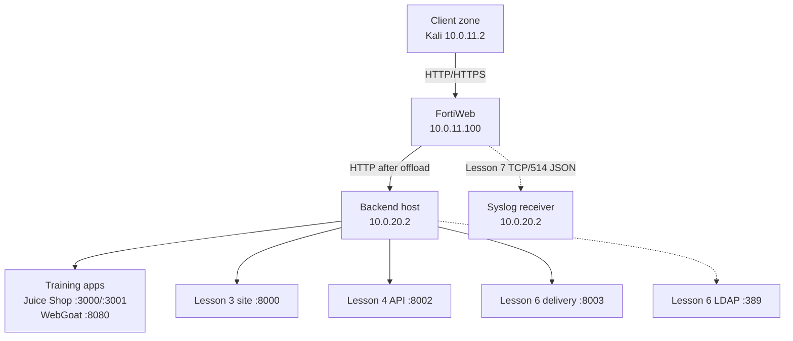

# Architecture

## Trust zones and flow

| Zone | Addressing | Role |
| --- | --- | --- |
| Client side | `10.0.11.0/24` | Kali generates known-good and attack traffic |
| FortiWeb entry | `port2 10.0.11.1`, VIP `10.0.11.100` | TLS termination, routing, WAF/API enforcement, delivery, DoS controls, and logging |
| Server side | `port3 10.0.20.1`, backend `10.0.20.2` | Application pools, deterministic test services, isolated LDAP, and lab syslog receiver |

## Request selection

1. Kali resolves every `*.lab.local` name to `10.0.11.100`.
2. `Vip1` receives the connection.
3. `Test1_pol` inspects the Host header in HTTP Content Routing mode.
4. The selected route chooses the server pool.
5. `clone_inline` and its child policies inspect or transform the request/response.
6. Direct `Test1_pol` controls can authenticate, cache, accelerate, script, or rate-limit the transaction.
7. `POLHTTP7` evaluates session/source-IP request and connection limits; Layer 3 Fragment Protection handles packet structure before HTTP.
8. FortiWeb forwards allowed traffic to the selected backend over HTTP.
9. Local logs retain Event, Attack, and Traffic context; selected records are forwarded as JSON to `10.0.20.2:514/TCP`.

## Lesson 7 control planes

| Plane | Objects | Identity/resource |
| --- | --- | --- |
| HTTP session | `FP_1`, `MALIP_7` | Per-session URL request rate and concurrent TCP connections |
| Source IP | `HAL_7`, `TCPFP_7` | Aggregate request rate and fully formed TCP connections |
| Packet | Layer 3 Fragment Protection | Fragmented/malformed IP traffic before a complete HTTP request |
| Observability | Disk logs, `syslogssss`, `sensitive_l7` | Local evidence, remote JSON delivery, and log-value masking |

## Design invariants

- One VIP is retained across all lessons.
- New lessons add routes, pools, or protection objects without replacing the working base.
- Every negative test is paired with a known-good request.
- Earlier hostnames are regression-tested after protection changes.
- Backend-local validation precedes WAF troubleshooting.
- Authentication, caching, and queue tests use fresh independent sessions when cookies affect the result.
- DoS actions begin in Alert; only one low-threshold rule is deliberately enforced at a time.
- Blocking tests end with timer recovery and earlier-route regression checks.
