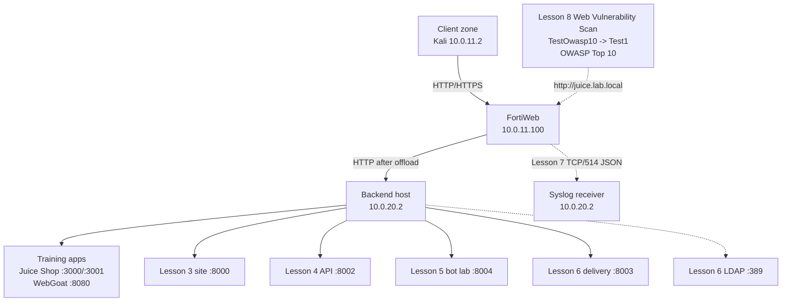

# Architecture

## Trust zones and flow

| Zone | Addressing | Role |
| --- | --- | --- |
| Client/assessment side | `10.0.11.0/24` plus authorized scan profile | Kali generates known-good/attack traffic; Lesson 8 assesses an existing published target |
| FortiWeb entry | `port2 10.0.11.1`, VIP `10.0.11.100` | TLS termination, routing, WAF/API enforcement, delivery, DoS controls, logging, and vulnerability-assessment workflow |
| Server side | `port3 10.0.20.1`, backend `10.0.20.2` | Application pools, deterministic test services, isolated LDAP, and lab syslog receiver |



## Request selection

1. Kali resolves every `*.lab.local` name to `10.0.11.100`.
2. `Vip1` receives the connection.
3. `Test1_pol` inspects the Host header in HTTP Content Routing mode.
4. The selected route chooses the server pool.
5. `clone_inline` and its child policies inspect or transform the request/response, including `bot_policy_l5` for Lesson 5.
6. Direct `Test1_pol` controls can run ML bot detection, authenticate, cache, accelerate, script, or rate-limit the transaction.
7. `POLHTTP7` evaluates session/source-IP request and connection limits; Layer 3 Fragment Protection handles packet structure before HTTP.
8. FortiWeb forwards allowed traffic to the selected backend over HTTP.
9. Local logs retain Event, Attack, and Traffic context; selected records are forwarded as JSON to `10.0.20.2:514/TCP`.

## Lesson 8 assessment plane

Lesson 8 did not alter the nine-step data-plane flow. Web Vulnerability Scan operates as a separate assessment workflow:

```text
Feature Visibility
  -> Scan Template: OWASP Top 10
  -> Scan Profile: Test1 -> http://juice.lab.local
  -> Scan Policy: TestOwasp10 -> Run Now -> captured Starting state
  -> Scan History -> dashboard/Recommendations
  -> validate -> remediate -> regression test -> rescan
```

| Component | Relationship to the integrated lab |
| --- | --- |
| Target | `http://juice.lab.local`; screenshot-verified |
| Routing/policy | Reuses `10.0.11.100`, `Vip1`, `Test1_pol`, and an existing route/pool |
| Enforcement profile | No new child attachment to `clone_inline` or `POLHTTP7` |
| Data-plane delta | None |
| Assessment objects | Profile `Test1`; template `OWASP Top 10`; policy `TestOwasp10`; `Run Now` |
| Captured state | `Starting` |

## Lesson 7 control planes

| Plane | Objects | Identity/resource |
| --- | --- | --- |
| HTTP session | `FP_1`, `MALIP_7` | Per-session URL request rate and concurrent TCP connections |
| Source IP | `HAL_7`, `TCPFP_7` | Aggregate request rate and fully formed TCP connections |
| Packet | Layer 3 Fragment Protection | Fragmented/malformed IP traffic before a complete HTTP request |
| Observability | Disk logs, `syslogssss`, `sensitive_l7` | Local evidence, remote JSON delivery, and log-value masking |

## Design invariants

- One VIP is retained across all lessons.
- New lessons add routes, pools, or protection objects without replacing the working base.
- Every negative test is paired with a known-good request.
- Earlier hostnames are regression-tested after protection changes.
- Backend-local validation precedes WAF troubleshooting.
- Authentication, caching, and queue tests use fresh independent sessions when cookies affect the result.
- Bot controls begin in Alert; temporary enforcement is tested with fresh automation identities, then returned to Alert in the shared-lab operating state.
- DoS actions begin in Alert; only one low-threshold rule is deliberately enforced at a time.
- Blocking tests end with timer recovery and earlier-route regression checks.
- Active scans require an authorized target, bounded crawl scope, approved window, and post-scan regression.
- Compliance mappings and dashboards support prioritization/evidence; they are not automatic certification.
