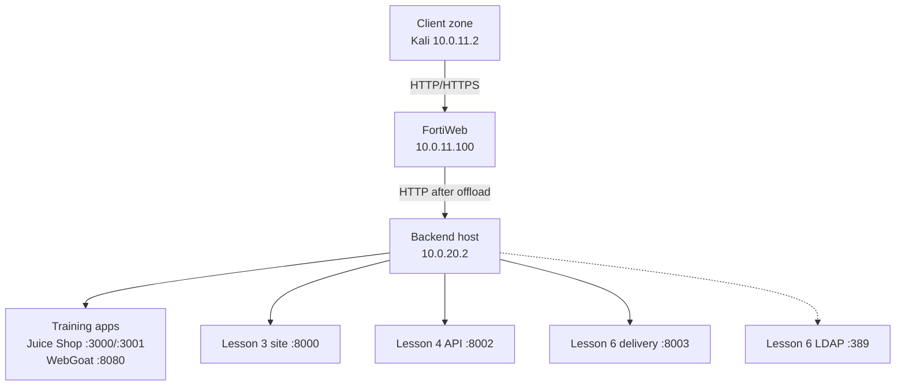

# Architecture

## Trust zones and flow

| Zone | Addressing | Role |
| --- | --- | --- |
| Client side | `10.0.11.0/24` | Kali generates known-good and attack traffic |
| FortiWeb entry | `port2 10.0.11.1`, VIP `10.0.11.100` | TLS termination, routing, WAF/API enforcement, publishing, and delivery controls |
| Server side | `port3 10.0.20.1`, backend `10.0.20.2` | Application pools, deterministic test services, and isolated LDAP |

## Request selection

1. Kali resolves every `*.lab.local` name to `10.0.11.100`.
2. `Vip1` receives the connection.
3. `Test1_pol` inspects the Host header in HTTP Content Routing mode.
4. The selected route chooses the server pool.
5. `clone_inline` and its child policies inspect or transform the request/response.
6. Direct `Test1_pol` controls can authenticate, cache, accelerate, script, or rate-limit the transaction.
7. FortiWeb forwards allowed traffic to the selected backend over HTTP.

## Design invariants

- One VIP is retained across all lessons.
- New lessons add routes, pools, or protection objects without replacing the working base.
- Every negative test is paired with a known-good request.
- Earlier hostnames are regression-tested after protection changes.
- Backend-local validation precedes WAF troubleshooting.
- Authentication, caching, and queue tests use fresh independent sessions when cookies affect the result.
