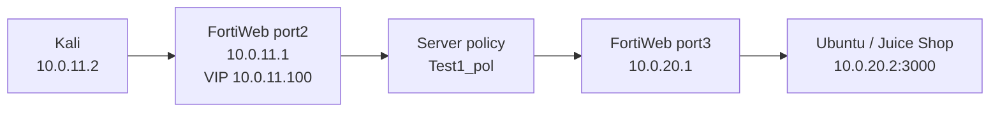

# Lesson 01 - Reverse Proxy Foundation

> Lab status: Complete  
> Documentation status: Complete  
> Completed: 2026-07-05  
> Starting point: Clean FortiWeb EVE-NG topology

## 1. Scope

Lesson 1 established the minimum working FortiWeb reverse-proxy path. The objective was to publish OWASP Juice Shop through a dedicated FortiWeb VIP and prove that an HTTP request crossed the entire client-to-WAF-to-backend chain.

Advanced protection, content routing, persistence, X-Forwarded-For, and TLS offloading were deliberately deferred until the simple path worked.

### Completion criteria

- Kali reaches the FortiWeb client-side interface.
- FortiWeb reaches the Ubuntu backend.
- Juice Shop is healthy on the backend host.
- The dedicated VIP accepts HTTP traffic.
- A request to the VIP returns Juice Shop HTML through FortiWeb.

## 2. Architecture



### IP plan

| Component | Address | Purpose |
| --- | --- | --- |
| FortiWeb management | `https://192.168.1.32` in the recorded lab | GUI only; not part of the application data path |
| FortiWeb `port2` | `10.0.11.1/24` | Client-facing data-plane interface |
| FortiWeb VIP | `10.0.11.100` | Address exposed to the client |
| Kali | `10.0.11.2/24`, gateway `10.0.11.1` | Client and attack workstation |
| FortiWeb `port3` | `10.0.20.1/24` | Server-facing data-plane interface |
| Ubuntu backend | `10.0.20.2/24`, gateway `10.0.20.1` | Docker host for backend applications |
| Juice Shop | `10.0.20.2:3000` | First protected application |

FortiWeb must use the Ubuntu host address and published port. Docker bridge addresses such as `172.17.x.x` are internal container addresses and were not used as pool members.

## 3. Client and backend preparation

### Kali configuration

```bash
sudo ip link set eth0 up
sudo ip addr flush dev eth0
sudo ip addr add 10.0.11.2/24 dev eth0
sudo ip route replace default via 10.0.11.1
ping -c 2 10.0.11.1
```

Expected and observed result: Kali could ping FortiWeb `port2` at `10.0.11.1`.

### Backend validation

The Ubuntu backend used `10.0.20.2/24` with default gateway `10.0.20.1`.

```bash
docker ps
curl -I http://127.0.0.1:3000
curl -I http://10.0.20.2:3000
```

If Juice Shop is not already running:

```bash
docker run -d --name juiceshop1 -p 3000:3000 bkimminich/juice-shop
```

Both local requests must succeed before FortiWeb troubleshooting begins.

## 4. FortiWeb objects created

| Order | Object type | Recorded name | Critical values | Purpose |
| ---: | --- | --- | --- | --- |
| 1 | Network Virtual IP | `VIP1` or `vip_juiceshop` | IPv4 `10.0.11.100`, interface `port2`, Use Interface IP disabled | Dedicated application address |
| 2 | Virtual Server | `Vip1` | Uses `VIP1 (10.0.11.100)`, enabled | Listener selected by the server policy |
| 3 | Health Check | `hc_icmp_juice` | Type ICMP | Backend availability check |
| 4 | Server Pool | `Juice_shop` or `pool_juiceshop` | `10.0.20.2:3000`, Round Robin | Juice Shop backend target |
| 5 | Protected Hostnames | Initial permissive object | Permissive for first validation | Avoid hostname restrictions during base-path testing |
| 6 | Service | Built-in HTTP service | TCP/80 | Client-side HTTP listener |
| 7 | Server Policy | `Test1_pol` | `Vip1` + HTTP + hostname + Juice Shop pool | Complete reverse-proxy binding |

### Configuration sequence

1. Configure `port2` as `10.0.11.1/24` and `port3` as `10.0.20.1/24`.
2. Create the Network Virtual IP `10.0.11.100` on `port2`.
3. Create or select `Vip1` and bind it to the dedicated VIP.
4. Create the ICMP health check.
5. Create the Juice Shop pool and add `10.0.20.2:3000`.
6. Create a permissive protected-hostname object for first testing.
7. Create `Test1_pol`, select the virtual server, HTTP service, protected hostname, and Juice Shop pool.
8. Enable/save the policy.

## 5. Validation

### Connectivity checks

```bash
# From Kali
ping -c 2 10.0.11.1

# From the FortiWeb CLI
execute ping 10.0.20.2

# From Ubuntu
curl -I http://10.0.20.2:3000
```

### End-to-end reverse-proxy request

```bash
curl -v http://10.0.11.100
```

Expected proof:

- TCP connected to `10.0.11.100:80`.
- Response was `HTTP/1.1 200 OK`.
- Returned HTML contained `<title>OWASP Juice Shop</title>`.

Observed result: all three conditions were met. FortiWeb was forwarding application traffic as a reverse proxy, not merely answering ICMP.

## 6. Attacks attempted

No attack payload was part of Lesson 1. This lesson intentionally proved delivery before security enforcement. Introducing an attack before the base route worked would have made WAF blocks, route failures, and backend failures difficult to distinguish.

## 7. Debugging guide

| Symptom | Likely cause | Fix |
| --- | --- | --- |
| Kali cannot ping `10.0.11.1` | Kali interface/address, EVE link, or FortiWeb `port2` | Recheck the Kali address/gateway, EVE cable/switch, and `port2` status |
| FortiWeb cannot ping `10.0.20.2` | Backend address/gateway, EVE link, or `port3` | Confirm Ubuntu uses gateway `10.0.20.1` and verify `port3`/EVE connectivity |
| Backend-local `curl` fails | Container missing or port not published | Check `docker ps`; start Juice Shop with `-p 3000:3000` |
| VIP request hangs | VIP, virtual server, service, or policy is disabled/misbound | Check the VIP interface, `Vip1`, HTTP service, and `Test1_pol` status |
| FortiWeb pool is down while Docker works | Pool points at a Docker bridge IP or wrong port | Use `10.0.20.2:3000`, not the container-only `172.17.x.x` address |

## 8. Final validated state

| Check | Final result |
| --- | --- |
| Kali to FortiWeb `port2` | Passed |
| FortiWeb to Ubuntu backend | Passed |
| Juice Shop on backend port `3000` | Passed |
| VIP `10.0.11.100:80` | Passed |
| End-to-end Juice Shop response | `200 OK`, correct application HTML |

Lesson 1 ended with one working VIP, one virtual server, one pool member, and one server policy. Lesson 2 modifies this same delivery path instead of creating a separate lab.

