# Lesson 02 - Content Routing and Delivery

> Lab status: Complete  
> Documentation status: Complete  
> Completed: 2026-07-05  
> Depends on: [Lesson 01](../01-reverse-proxy-foundation/README.md)

## 1. Scope

Lesson 2 evolved the working Lesson 1 reverse proxy into a multi-application delivery system. The same VIP and server policy were retained, and the HTTP `Host` header selected the correct pool.

The lesson also added a second Juice Shop member, persistence, original-client-IP forwarding, an IP group, first inline WAF enforcement, and client-side HTTPS offloading.

## 2. Architecture delta

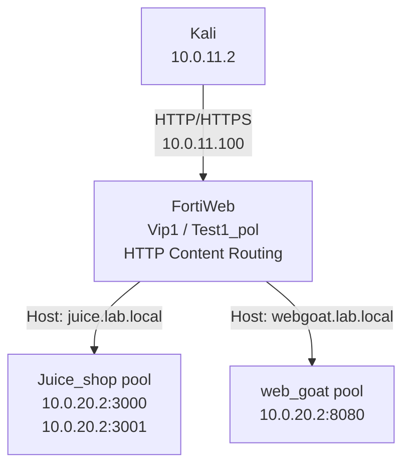

The Lesson 1 policy was converted to HTTP Content Routing. A second policy was not created because competing policies on the same VIP/service would make selection and troubleshooting ambiguous.

## 3. Backend containers

```bash
# Inspect current state
docker ps

# First Juice Shop, if missing
docker run -d --name juiceshop1 -p 3000:3000 bkimminich/juice-shop

# Second Juice Shop member for load-balancing/persistence practice
docker run -d --name juiceshop2 -p 3001:3000 bkimminich/juice-shop

# WebGoat
docker run -d --name webgoat \
  -p 8080:8080 \
  -p 9090:9090 \
  webgoat/webgoat
```

Validate both loopback and backend-host paths:

```bash
curl -I http://127.0.0.1:3000
curl -I http://127.0.0.1:3001
curl -I http://127.0.0.1:8080/WebGoat

curl -I http://10.0.20.2:3000
curl -I http://10.0.20.2:3001
curl -I http://10.0.20.2:8080/WebGoat
```

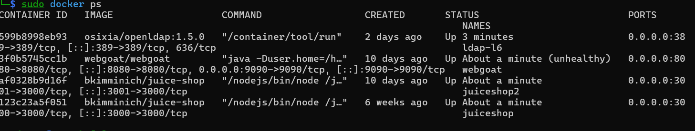

This later-state capture directly shows `juiceshop` on host port `3000`, `juiceshop2` on host port `3001`, and WebGoat on host ports `8080` and `9090`. WebGoat is marked `unhealthy` at this capture, so the image is not presented as final health proof. The separate routed WebGoat response below was captured later and returned the expected application redirect. The LDAP container belongs to the later cumulative lab and is not a Lesson 2 addition.

## 4. Hostname mapping

Kali resolves both application names to the same FortiWeb VIP:

```text
10.0.11.100 juice.lab.local webgoat.lab.local
```

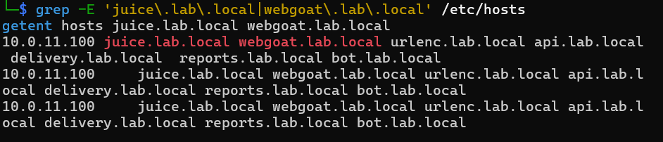

The terminal capture directly shows both `juice.lab.local` and `webgoat.lab.local` resolving to the shared VIP `10.0.11.100`. It was collected after more hostnames had been added to the same hosts-file entry, so the additional Lessons 3-6 names are later cumulative state rather than Lesson 2 objects.

## 5. FortiWeb objects created or changed

| Object type | Name | Critical values | Attachment/use |
| --- | --- | --- | --- |
| Server Pool | `Juice_shop` / `pool_juiceshop` | `10.0.20.2:3000`, `10.0.20.2:3001`, Round Robin | `route_juice` |
| Server Pool | `web_goat` / `pool_webgoat` | `10.0.20.2:8080`, Round Robin | `route_webgoat` |
| Protected Hostnames | `host_lab_apps` | Accept `juice.lab.local`, `webgoat.lab.local` | `Test1_pol` |
| HTTP Content Route | `route_juice` | Host prefix `juice.lab.local`; Reverse disabled | Juice Shop pool |
| HTTP Content Route | `route_webgoat` | Host prefix `webgoat.lab.local`; Reverse disabled | WebGoat pool |
| Persistence | `persist_source_ip` | Source IP, `/32` mask, 300-second timeout | Juice Shop pool |
| X-Forwarded-For | `xff_original` | Add XFF, append on right | Active policy/profile path |
| IP Group | `ipgrp_kali_client` | `10.0.11.2/32` | Reusable client object; not a WAF bypass |
| Certificate | `cert_lab_apps` or local lab certificate | CN `juice.lab.local`; SANs should cover both apps | `Test1_pol` HTTPS settings |
| Server Policy | `Test1_pol` | HTTP Content Routing, `Vip1`, both routes, HTTP/HTTPS | Existing policy converted |

### Final server-policy values

| Setting | Value |
| --- | --- |
| Deployment mode | HTTP Content Routing |
| Virtual server | `Vip1` / `10.0.11.100` |
| Routes | `route_juice`, `route_webgoat` |
| Protected hostnames | `host_lab_apps` |
| HTTP service | TCP/80 |
| HTTPS service | TCP/443 after TLS configuration |
| Certificate type | Local |
| Backend SSL | Disabled; offloaded traffic remains HTTP to the pools |

### Captured object and policy state

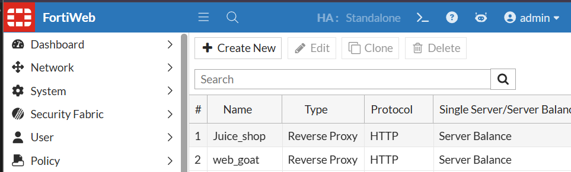

The pool list directly verifies the `Juice_shop` and `web_goat` Reverse Proxy/HTTP pool objects. The capture does not expose either pool's member addresses, health checks, load-balancing algorithm, or persistence settings.

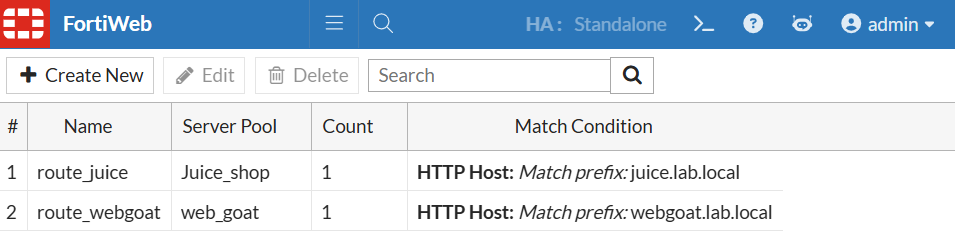

The content-routing list directly verifies `route_juice` -> `Juice_shop` for HTTP Host prefix `juice.lab.local` and `route_webgoat` -> `web_goat` for HTTP Host prefix `webgoat.lab.local`. It does not show whether the routes are attached to an enabled server policy; that relationship is captured separately.

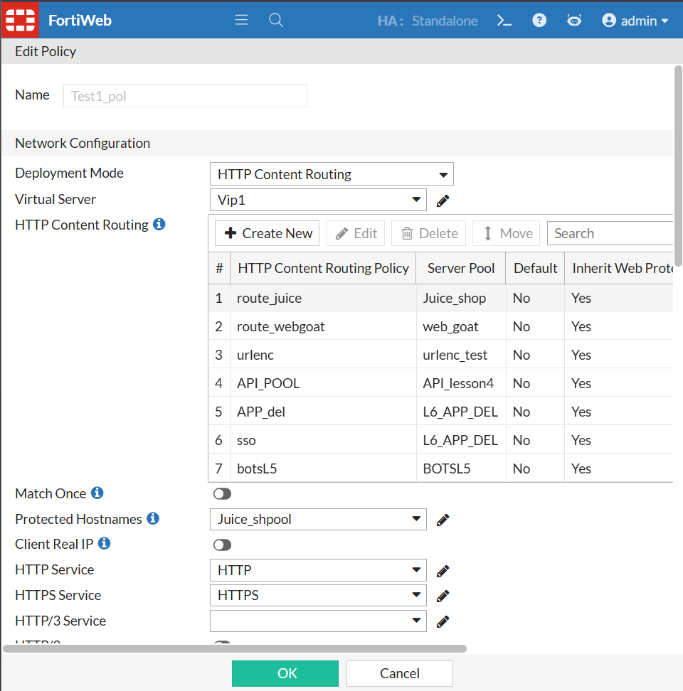

The later server-policy capture directly shows `Test1_pol` in HTTP Content Routing mode on `Vip1`, with the two Lesson 2 routes first in the inherited route list, HTTP and HTTPS services selected, Client Real IP off, and protected-hostname object `Juice_shpool`. It also contains routes introduced by later lessons, so it is evidence that the Lesson 2 path survived in the integrated policy—not a clean Lesson 2 point-in-time capture. The repository narrative records the initial protected-hostname object as `host_lab_apps`; the later capture instead shows `Juice_shpool`, and both records are retained. Because this is an edit form with an `OK` button visible, it does not by itself prove that the displayed state was saved.

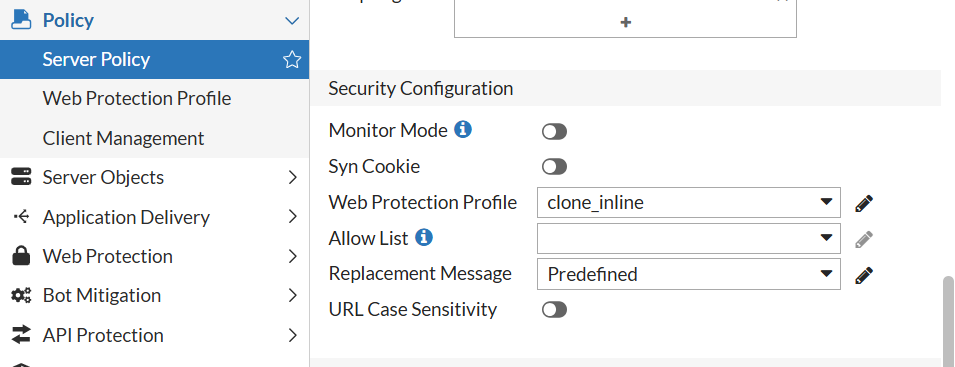

This later security-configuration capture shows `clone_inline` selected as a Web Protection Profile with Monitor Mode off. `clone_inline` belongs to the protection chain developed after Lesson 2, and the crop does not show the policy name. It therefore supports the cumulative protected-policy state but does not prove the identity or settings of the original Lesson 2 inline profile.

## 6. Content-routing validation

### Raw Host-header tests

```bash
curl -v -H "Host: juice.lab.local" http://10.0.11.100
curl -v -H "Host: webgoat.lab.local" http://10.0.11.100/WebGoat
```

Observed results:

- `juice.lab.local` returned `HTTP/1.1 200 OK` and Juice Shop HTML.
- `webgoat.lab.local` returned the normal WebGoat `302` redirect toward `/WebGoat/`.

### Normal hostname tests

```bash
curl -v http://juice.lab.local
curl -v http://webgoat.lab.local/WebGoat/
```

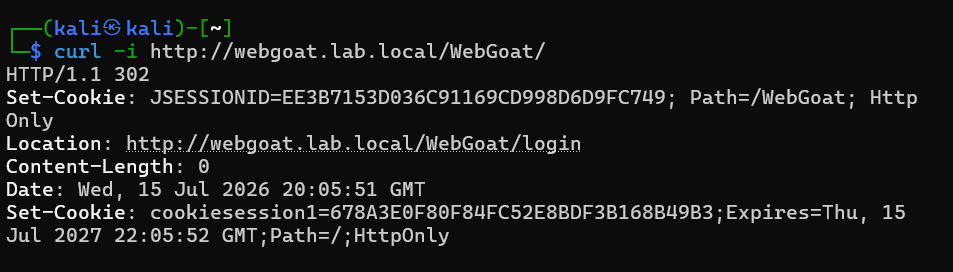

The capture directly shows `http://webgoat.lab.local/WebGoat/` returning `HTTP/1.1 302` with `Location: http://webgoat.lab.local/WebGoat/login`. It also shows the application `JSESSIONID` and FortiWeb `cookiesession1`; these are isolated-lab transaction cookies captured in a historical response. Because the command used `curl -i` rather than verbose connection output, this screenshot does not independently display the resolved VIP or backend pool selection.

## 7. Source-IP persistence

`persist_source_ip` pinned requests from `10.0.11.2` to one Juice Shop member for 300 seconds.

```bash
# Ubuntu terminal 1
docker logs -f juiceshop1

# Ubuntu terminal 2
docker logs -f juiceshop2

# Kali
for i in {1..10}; do
  curl -s -o /dev/null -w "%{http_code}\n" http://juice.lab.local
done
```

Expected result: repeated requests from the same client stay on the same member during the persistence window.

## 8. Original client IP with X-Forwarded-For

FortiWeb normally opens the backend TCP connection from its server-side address, so the backend sees `10.0.20.1` as the TCP source. `X-Forwarded-For` preserves the original client identity at the HTTP layer without changing the TCP source.

### `xff_original` settings

| Setting | Value |
| --- | --- |
| Add X-Forwarded-For | On |
| IP location to add | Right |
| Add source/X-Forwarded port | Off |
| Add X-Real-IP | Off |
| Delete/merge previous XFF | Off for this direct lab |
| Use X-header to identify original IP | Off; no upstream CDN/proxy exists |
| Client Real IP | Off |

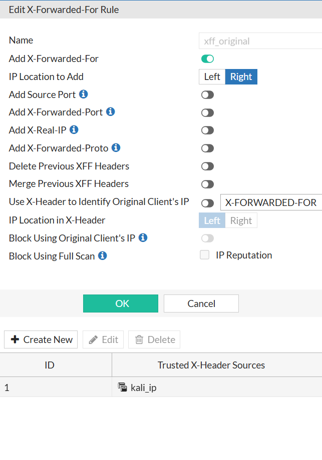

The configuration capture directly verifies rule `xff_original`, X-Forwarded-For enabled, insertion on the right, and the source-port, forwarded-port, X-Real-IP, X-Forwarded-Proto, delete, merge, and upstream-X-header identification options disabled. It also lists `kali_ip` as a trusted X-header source while upstream-X-header identification is off; the listed source therefore does not change the direct-lab behavior shown here. The edit form alone does not prove policy attachment or save state.

`Client Real IP` was deliberately left off. It changes how FortiWeb originates the backend connection and requires correct return routing; it is not the same feature as adding XFF.

### Verification

```bash
# Ubuntu
sudo tcpdump -A -s0 -i any port 3000

# Kali
curl -v http://juice.lab.local
```

Before attachment, the backend saw the request but no XFF header, and the TCP source was `10.0.20.1`. After attachment, the expected header was:

```http
X-Forwarded-For: 10.0.11.2
```

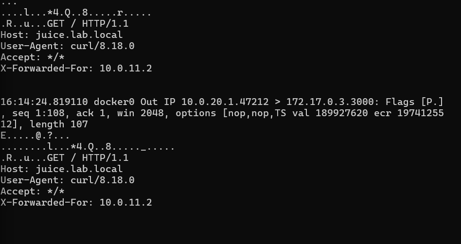

The backend-side packet capture directly shows readable HTTP with `Host: juice.lab.local` and `X-Forwarded-For: 10.0.11.2`. It also shows the FortiWeb server-side source `10.0.20.1` reaching Docker bridge address `172.17.0.3:3000`; this is the host-to-container forwarding leg and does not mean the FortiWeb pool targeted the bridge address. The capture proves runtime header insertion but does not identify the FortiWeb rule or policy by name.

The later WAF block page also reported client IP `10.0.11.2`, proving FortiWeb recognized the original client.

## 9. IP group

The repository narrative records the reusable object as `ipgrp_kali_client`, while the supplied FortiWeb capture directly shows capture-time object `kali_ip` containing `10.0.11.2`. The screenshot does not display CIDR notation, so `/32` remains narrative-recorded rather than screenshot-proven. The object was created for future exceptions, allowlists, and client-management rules, but it was not used as a broad WAF bypass because that would exempt the attack workstation from inspection.

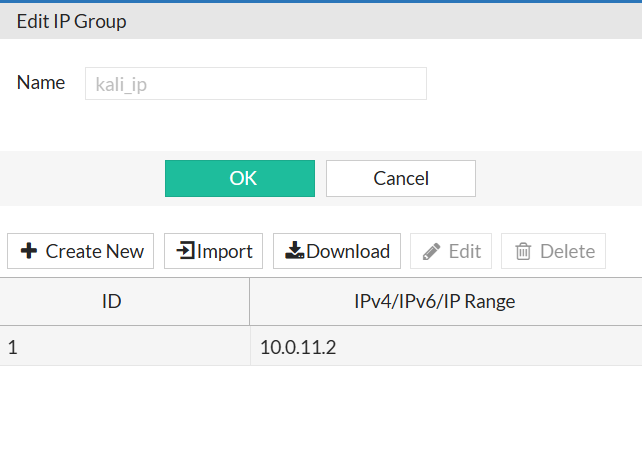

## 10. First inline WAF tests

An inline Web Protection Profile was attached after routing worked.

```bash
curl -v "http://juice.lab.local/?q=<script>alert(1)</script>"
curl -v "http://juice.lab.local/?id=1' OR '1'='1"
```

Observed enforcement evidence:

| Field | Observed value |
| --- | --- |
| Response | FortiWeb `Web Page Blocked` page |
| Client IP | `10.0.11.2` |
| Attack ID | `20000008` |
| URL/host | `juice.lab.local` |

The test established that traffic was not only reverse-proxied but inspected. Attack and traffic records were checked under FortiWeb's Log & Report views.

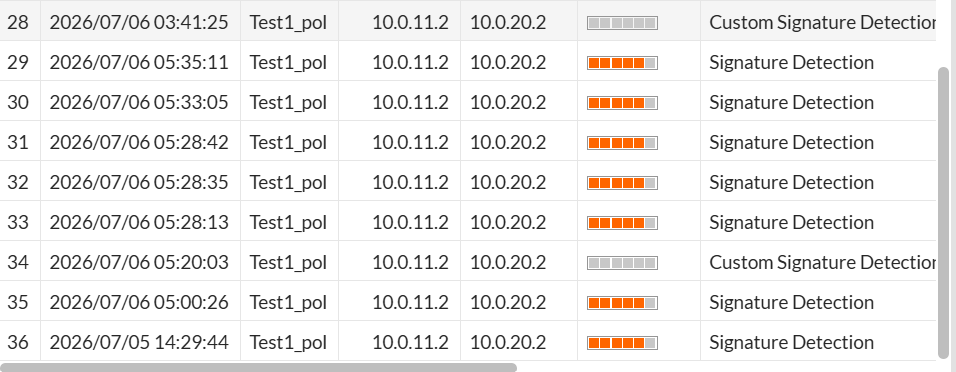

The log capture directly shows `Test1_pol` Signature Detection events for client `10.0.11.2` and server `10.0.20.2`, including one row dated `2026/07/05`, plus later `2026/07/06` Signature Detection and Custom Signature Detection rows from the cumulative lab. The cropped columns do not expose hostname, URL, attack ID, action, or request payload, so no individual row is claimed as direct proof of the documented XSS/SQLi command or block response.

## 11. HTTPS offloading

TLS terminated at FortiWeb:

```text
Kali -- HTTPS/443 --> FortiWeb -- HTTP --> backend pools
```

The local certificate used `juice.lab.local` as its common name; a certificate with SANs for both lab hostnames is preferable. Because the certificate was self-signed, `curl -k` was expected.

```bash
curl -vk https://juice.lab.local
curl -vk https://webgoat.lab.local/WebGoat/
```

Observed result: the TLS handshake completed, Juice Shop returned `200`, and WebGoat returned its normal application response/redirect.

To prove the backend leg remained HTTP:

```bash
# Ubuntu
sudo tcpdump -A -s0 -i any port 3000

# Kali
curl -vk https://juice.lab.local
```

The Ubuntu capture contained readable HTTP request lines such as `GET / HTTP/1.1` and `Host: juice.lab.local`.

## 12. Debugging issues and fixes

| Symptom | Cause | Fix |
| --- | --- | --- |
| Hostname does not resolve | Missing `/etc/hosts` entry | Map both names to `10.0.11.100` |
| Juice Shop works but WebGoat does not | Wrong WebGoat pool/route, container down, or wrong path | Test `10.0.20.2:8080/WebGoat`; verify Host match and use `/WebGoat/` |
| WebGoat returns `302` | Normal redirect | Follow/use `/WebGoat/` |
| Backend sees `10.0.20.1` | Normal reverse-proxy TCP source | Use XFF for original-client visibility |
| XFF object exists but header is absent | Object not attached/applied | Attach `xff_original` to the active path, save, and retest |
| HTTPS fails while HTTP works | HTTPS service or certificate missing | Select TCP/443 and local certificate; keep backend SSL disabled |
| Browser warns about certificate | Self-signed lab certificate | Expected; use `curl -k` or trust it locally |
| Payload blocks during monitor testing | Rule/profile action already set to deny | Temporarily use Alert/Monitor, then restore enforcement |

## 13. Evidence index

| Evidence | Directly proves | Does not prove / limitation |
| --- | --- | --- |
| [`02-backend-containers-later-state.png`](evidence/02-backend-containers-later-state.png) | Juice Shop on `3000`/`3001`; WebGoat on `8080`/`9090` | WebGoat is `unhealthy`; later LDAP is visible; no backend IP or final health proof |
| [`02-client-hostname-resolution.png`](evidence/02-client-hostname-resolution.png) | Both Lesson 2 hostnames resolve to `10.0.11.100` | Hosts-file entry also contains later hostnames |
| [`02-server-pool-list.png`](evidence/02-server-pool-list.png) | `Juice_shop` and `web_goat` Reverse Proxy/HTTP pools exist | Members, health, load balancing, and persistence are not visible |
| [`02-content-routing-policies.png`](evidence/02-content-routing-policies.png) | Exact two hostname-prefix route-to-pool mappings | Server-policy attachment/save state is not visible |
| [`02-server-policy-integrated-state.png`](evidence/02-server-policy-integrated-state.png) | Later `Test1_pol`, `Vip1`, HTTP Content Routing, two inherited routes, HTTP/HTTPS, Client Real IP off | Later routes are present; protected hostname is `Juice_shpool`, not narrative `host_lab_apps`; edit form does not prove save state |
| [`02-web-protection-profile-later-state.png`](evidence/02-web-protection-profile-later-state.png) | A Server Policy edit view selects `clone_inline`; Monitor Mode is off | Crop omits policy name; `clone_inline` is later cumulative state, not the original Lesson 2 profile |
| [`02-webgoat-http-302-response.png`](evidence/02-webgoat-http-302-response.png) | WebGoat hostname returns the expected `/WebGoat/login` redirect and FortiWeb session cookie | Contains historical isolated-lab cookie values; no verbose resolution, VIP connection, or pool-selection output |
| [`02-xff-rule-settings.png`](evidence/02-xff-rule-settings.png) | `xff_original` option values and capture-time trusted source `kali_ip` | Configuration/edit view, not runtime attachment or save proof |
| [`02-xff-backend-packet-capture.png`](evidence/02-xff-backend-packet-capture.png) | Runtime `Host` and `X-Forwarded-For: 10.0.11.2`; TCP source `10.0.20.1` | Does not name the FortiWeb rule/policy; Docker bridge destination is only the internal forwarding leg |
| [`02-ip-group-kali-ip.png`](evidence/02-ip-group-kali-ip.png) | Capture-time IP group `kali_ip` contains `10.0.11.2` | Narrative name differs; `/32` notation and attachment/use are not displayed |
| [`02-attack-log-signature-events.png`](evidence/02-attack-log-signature-events.png) | Signature events under `Test1_pol` for `10.0.11.2` -> `10.0.20.2` | Mixed Lesson 2/3 dates; no payload, host, action, response, URL, or attack ID |

No supplied screenshot directly proves the Juice Shop pool members, source-IP persistence settings/behavior, protected-hostname membership, certificate details, TLS handshake, or readable HTTP backend leg after HTTPS offload. Those completed capabilities remain repository-recorded rather than newly screenshot-proven.

## 14. Final validated state

The table below is the repository-recorded final Lesson 2 state. Direct screenshot coverage and limitations are separated in the evidence index above.

| Capability | Result |
| --- | --- |
| One VIP serving two hostnames | Complete |
| Juice Shop two-member pool | Complete |
| WebGoat pool and route | Complete |
| Source-IP persistence | Complete |
| X-Forwarded-For | Complete |
| Reusable Kali IP group | Complete |
| Inline WAF block/log behavior | Complete |
| HTTPS offload with HTTP backend | Complete |

The next lesson starts from this stable routing and delivery base and changes the protection/profile layer rather than rebuilding networking.
