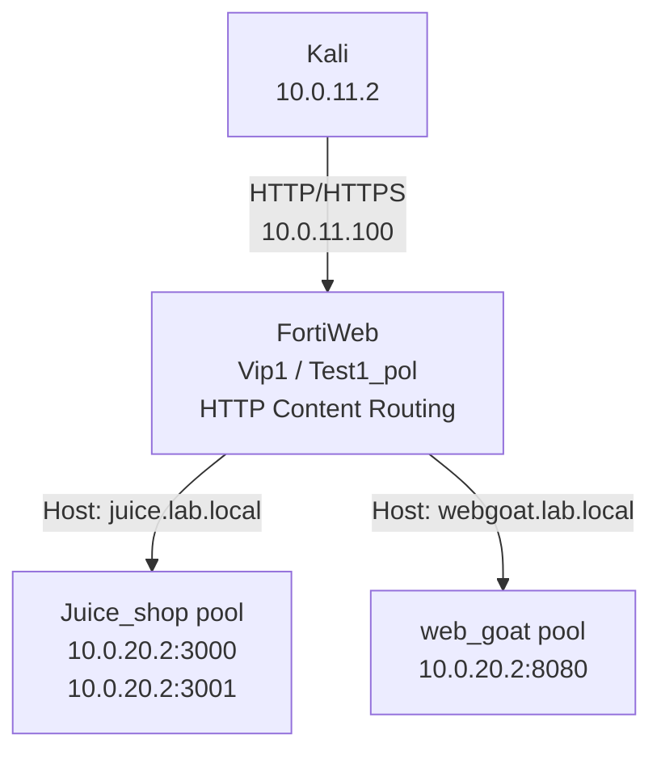

# Lesson 02 - Content Routing and Delivery

> Lab status: Complete  
> Documentation status: Complete  
> Completed: 2026-07-05  
> Depends on: [Lesson 01](../01-reverse-proxy-foundation/README.md)

## 1. Scope

Lesson 2 evolved the working Lesson 1 reverse proxy into a multi-application delivery system. The same VIP and server policy were retained, and the HTTP `Host` header selected the correct pool.

The lesson also added a second Juice Shop member, persistence, original-client-IP forwarding, an IP group, first inline WAF enforcement, and client-side HTTPS offloading.

## 2. Architecture delta



The Lesson 1 policy was converted to HTTP Content Routing. A second policy was not created because competing policies on the same VIP/service would make selection and troubleshooting ambiguous.

## 3. Backend containers

```bash
# Inspect current state
docker ps

# First Juice Shop, if missing
docker run -d --name juiceshop1 -p 3000:3000 bkimminich/juice-shop

# Second Juice Shop member for load-balancing/persistence practice
docker run -d --name juiceshop2 -p 3001:3000 bkimminich/juice-shop

# WebGoat
docker run -d --name webgoat \
  -p 8080:8080 \
  -p 9090:9090 \
  webgoat/webgoat
```

Validate both loopback and backend-host paths:

```bash
curl -I http://127.0.0.1:3000
curl -I http://127.0.0.1:3001
curl -I http://127.0.0.1:8080/WebGoat

curl -I http://10.0.20.2:3000
curl -I http://10.0.20.2:3001
curl -I http://10.0.20.2:8080/WebGoat
```

## 4. Hostname mapping

Kali resolves both application names to the same FortiWeb VIP:

```text
10.0.11.100 juice.lab.local webgoat.lab.local
```

## 5. FortiWeb objects created or changed

| Object type | Name | Critical values | Attachment/use |
| --- | --- | --- | --- |
| Server Pool | `Juice_shop` / `pool_juiceshop` | `10.0.20.2:3000`, `10.0.20.2:3001`, Round Robin | `route_juice` |
| Server Pool | `web_goat` / `pool_webgoat` | `10.0.20.2:8080`, Round Robin | `route_webgoat` |
| Protected Hostnames | `host_lab_apps` | Accept `juice.lab.local`, `webgoat.lab.local` | `Test1_pol` |
| HTTP Content Route | `route_juice` | Host prefix `juice.lab.local`; Reverse disabled | Juice Shop pool |
| HTTP Content Route | `route_webgoat` | Host prefix `webgoat.lab.local`; Reverse disabled | WebGoat pool |
| Persistence | `persist_source_ip` | Source IP, `/32` mask, 300-second timeout | Juice Shop pool |
| X-Forwarded-For | `xff_original` | Add XFF, append on right | Active policy/profile path |
| IP Group | `ipgrp_kali_client` | `10.0.11.2/32` | Reusable client object; not a WAF bypass |
| Certificate | `cert_lab_apps` or local lab certificate | CN `juice.lab.local`; SANs should cover both apps | `Test1_pol` HTTPS settings |
| Server Policy | `Test1_pol` | HTTP Content Routing, `Vip1`, both routes, HTTP/HTTPS | Existing policy converted |

### Final server-policy values

| Setting | Value |
| --- | --- |
| Deployment mode | HTTP Content Routing |
| Virtual server | `Vip1` / `10.0.11.100` |
| Routes | `route_juice`, `route_webgoat` |
| Protected hostnames | `host_lab_apps` |
| HTTP service | TCP/80 |
| HTTPS service | TCP/443 after TLS configuration |
| Certificate type | Local |
| Backend SSL | Disabled; offloaded traffic remains HTTP to the pools |

## 6. Content-routing validation

### Raw Host-header tests

```bash
curl -v -H "Host: juice.lab.local" http://10.0.11.100
curl -v -H "Host: webgoat.lab.local" http://10.0.11.100/WebGoat
```

Observed results:

- `juice.lab.local` returned `HTTP/1.1 200 OK` and Juice Shop HTML.
- `webgoat.lab.local` returned the normal WebGoat `302` redirect toward `/WebGoat/`.

### Normal hostname tests

```bash
curl -v http://juice.lab.local
curl -v http://webgoat.lab.local/WebGoat/
```

## 7. Source-IP persistence

`persist_source_ip` pinned requests from `10.0.11.2` to one Juice Shop member for 300 seconds.

```bash
# Ubuntu terminal 1
docker logs -f juiceshop1

# Ubuntu terminal 2
docker logs -f juiceshop2

# Kali
for i in {1..10}; do
  curl -s -o /dev/null -w "%{http_code}\n" http://juice.lab.local
done
```

Expected result: repeated requests from the same client stay on the same member during the persistence window.

## 8. Original client IP with X-Forwarded-For

FortiWeb normally opens the backend TCP connection from its server-side address, so the backend sees `10.0.20.1` as the TCP source. `X-Forwarded-For` preserves the original client identity at the HTTP layer without changing the TCP source.

### `xff_original` settings

| Setting | Value |
| --- | --- |
| Add X-Forwarded-For | On |
| IP location to add | Right |
| Add source/X-Forwarded port | Off |
| Add X-Real-IP | Off |
| Delete/merge previous XFF | Off for this direct lab |
| Use X-header to identify original IP | Off; no upstream CDN/proxy exists |
| Client Real IP | Off |

`Client Real IP` was deliberately left off. It changes how FortiWeb originates the backend connection and requires correct return routing; it is not the same feature as adding XFF.

### Verification

```bash
# Ubuntu
sudo tcpdump -A -s0 -i any port 3000

# Kali
curl -v http://juice.lab.local
```

Before attachment, the backend saw the request but no XFF header, and the TCP source was `10.0.20.1`. After attachment, the expected header was:

```http
X-Forwarded-For: 10.0.11.2
```

The later WAF block page also reported client IP `10.0.11.2`, proving FortiWeb recognized the original client.

## 9. IP group

The reusable object `ipgrp_kali_client` contained `10.0.11.2/32`. It was created for future exceptions, allowlists, and client-management rules, but it was not used as a broad WAF bypass because that would exempt the attack workstation from inspection.

## 10. First inline WAF tests

An inline Web Protection Profile was attached after routing worked.

```bash
curl -v "http://juice.lab.local/?q=<script>alert(1)</script>"
curl -v "http://juice.lab.local/?id=1' OR '1'='1"
```

Observed enforcement evidence:

| Field | Observed value |
| --- | --- |
| Response | FortiWeb `Web Page Blocked` page |
| Client IP | `10.0.11.2` |
| Attack ID | `20000008` |
| URL/host | `juice.lab.local` |

The test established that traffic was not only reverse-proxied but inspected. Attack and traffic records were checked under FortiWeb's Log & Report views.

## 11. HTTPS offloading

TLS terminated at FortiWeb:

```text
Kali -- HTTPS/443 --> FortiWeb -- HTTP --> backend pools
```

The local certificate used `juice.lab.local` as its common name; a certificate with SANs for both lab hostnames is preferable. Because the certificate was self-signed, `curl -k` was expected.

```bash
curl -vk https://juice.lab.local
curl -vk https://webgoat.lab.local/WebGoat/
```

Observed result: the TLS handshake completed, Juice Shop returned `200`, and WebGoat returned its normal application response/redirect.

To prove the backend leg remained HTTP:

```bash
# Ubuntu
sudo tcpdump -A -s0 -i any port 3000

# Kali
curl -vk https://juice.lab.local
```

The Ubuntu capture contained readable HTTP request lines such as `GET / HTTP/1.1` and `Host: juice.lab.local`.

## 12. Debugging issues and fixes

| Symptom | Cause | Fix |
| --- | --- | --- |
| Hostname does not resolve | Missing `/etc/hosts` entry | Map both names to `10.0.11.100` |
| Juice Shop works but WebGoat does not | Wrong WebGoat pool/route, container down, or wrong path | Test `10.0.20.2:8080/WebGoat`; verify Host match and use `/WebGoat/` |
| WebGoat returns `302` | Normal redirect | Follow/use `/WebGoat/` |
| Backend sees `10.0.20.1` | Normal reverse-proxy TCP source | Use XFF for original-client visibility |
| XFF object exists but header is absent | Object not attached/applied | Attach `xff_original` to the active path, save, and retest |
| HTTPS fails while HTTP works | HTTPS service or certificate missing | Select TCP/443 and local certificate; keep backend SSL disabled |
| Browser warns about certificate | Self-signed lab certificate | Expected; use `curl -k` or trust it locally |
| Payload blocks during monitor testing | Rule/profile action already set to deny | Temporarily use Alert/Monitor, then restore enforcement |

## 13. Final validated state

| Capability | Result |
| --- | --- |
| One VIP serving two hostnames | Complete |
| Juice Shop two-member pool | Complete |
| WebGoat pool and route | Complete |
| Source-IP persistence | Complete |
| X-Forwarded-For | Complete |
| Reusable Kali IP group | Complete |
| Inline WAF block/log behavior | Complete |
| HTTPS offload with HTTP backend | Complete |

The next lesson starts from this stable routing and delivery base and changes the protection/profile layer rather than rebuilding networking.

