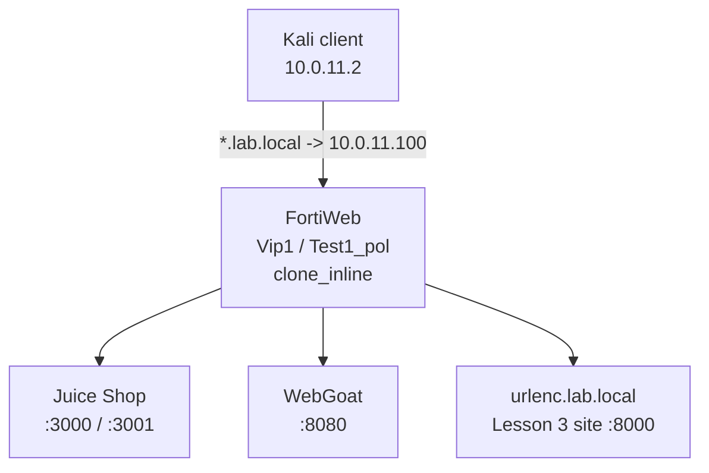

# Lesson 03 - Web Application Protection

> Lab status: Complete for the implemented scope
>
> Documentation status: Complete
>
> Completed: 2026-07-06
>
> Depends on: [Lessons 01-02](../02-content-routing-and-delivery/README.md)

## 1. Scope

Lesson 3 layered signature, response, client-side, input, and upload protections onto the existing single-VIP environment. It retained `10.0.11.100`, `Vip1`, `Test1_pol`, Juice Shop, and WebGoat, and added one deterministic backend on `10.0.20.2:8000` for controls that require clean HTML, forms, scripts, response markers, and file uploads.

This write-up is grounded in the original Lesson 3 implementation report, the reproducible backend assets, the sanitized-object record, and the committed attack script.

## 2. Integrated architecture



```text
Test1_pol
  +-- clone_inline
       +-- clone_standard
       |    +-- cgrp_lesson3_custom
       |         +-- custom_path_traversal
       |         +-- custom_json_sqli_login
       +-- CSRF / URL Encryption / Link Cloaking / DLP
       +-- HTTP Header / CORS / SRI
       +-- Parameter / Hidden Fields / File / Web Shell controls
```

The central troubleshooting lesson was attachment depth: a custom signature must be in a custom group, selected by the signature policy, selected by the web protection profile, and finally used by `Test1_pol`.

## 3. Deterministic Lesson 3 backend

| Item | Value |
| --- | --- |
| Hostname | `urlenc.lab.local` |
| Pool | `pool_urlenc_test` |
| Backend | `10.0.20.2:8000` |
| Route | `route_urlenc` -> `pool_urlenc_test` |
| Implementation | Python `ThreadingHTTPServer` plus static HTML/JavaScript assets |

Reproducible files are under [`../../vuln-sites/lesson3-test-site/`](../../vuln-sites/lesson3-test-site/README.md).

```bash
cd vuln-sites/lesson3-test-site
python3 upload_server.py

curl -i http://127.0.0.1:8000/
curl -i http://127.0.0.1:8000/public/lwjs.html
```

| Path | Control target |
| --- | --- |
| `/private/account.html` | URL Encryption |
| `/public/contact.html` | Link Cloaking |
| `/public/dlp.html` | Response DLP marker |
| `/public/lwjs.html` | Client-side/header validation |
| `/public/sri.html` and `/public/app.js` | Subresource Integrity |
| `/public/hidden.html` | Hidden-field session flow |
| `/public/upload.html` and `/upload` | File Security and Web Shell Detection |

## 4. Signature policy and known attacks

The built-in signature policy was not edited directly. `clone_standard` enabled the relevant Cross Site Scripting, SQL Injection, Generic Attacks, and Known Exploits categories. `clone_inline` selected that signature policy and was selected by `Test1_pol`.

```bash
curl -v "http://juice.lab.local/rest/products/search?q=<script>alert(1)</script>"
curl -v "http://juice.lab.local/rest/products/search?q=' OR '1'='1--"
curl -v "http://juice.lab.local/rest/products/search?q=../../../../etc/passwd"
curl -v "http://juice.lab.local/rest/products/search?q=%3Bcat%20/etc/passwd"
```

The report records detection in Alert mode followed by denial for selected attack categories while normal searches remained available.

## 5. Custom signatures

| Signature | Target | Logic | Attachment |
| --- | --- | --- | --- |
| `custom_path_traversal` | Parameter value; URI/raw URI where available | Traversal patterns such as `../`, encoded traversal, and backslash variants | `cgrp_lesson3_custom` -> `clone_standard` |
| `custom_json_sqli_login` | Request Raw Body | JSON login SQLi patterns | `cgrp_lesson3_custom` -> `clone_standard` |

The JSON signature initially did not fire when attached to ordinary Request Body or Parameter Value. Inspecting Request Raw Body matched the submitted JSON representation.

```bash
curl -v -X POST http://juice.lab.local/rest/user/login \
  -H 'Content-Type: application/json' \
  --data '{"email":"admin@juice-sh.op OR 1=1","password":"x"}'
```

## 6. XSS and SQL injection coverage

```bash
# XSS variants
curl -v "http://juice.lab.local/rest/products/search?q=<script>alert(1)</script>"
curl -v "http://juice.lab.local/rest/products/search?q=%3Cscript%3Ealert(1)%3C%2Fscript%3E"
curl -v "http://juice.lab.local/rest/products/search?q="

# SQLi variants
curl -v "http://juice.lab.local/rest/products/search?q=' OR '1'='1--"
curl -v "http://juice.lab.local/rest/products/search?q=%27%20OR%20%271%27%3D%271--"
curl -v "http://juice.lab.local/rest/products/search?q=' UNION SELECT NULL,NULL,NULL--"
```

The report records literal and encoded server-visible payload detection. Browser fragments after `#` remain client-side and are not sent to FortiWeb.

## 7. CSRF protection

The CSRF configuration distinguished pages that initialize/inject token logic from protected submission URLs:

| Setting | Lesson 3 value |
| --- | --- |
| Page list | `/` |
| Protected URL | `/rest/user/login` |
| AJAX check | Enabled |
| Final action | Alert & Deny |

```bash
curl -v -X POST http://juice.lab.local/rest/user/login \
  -H 'Content-Type: application/json' \
  --data '{"email":"test@test.com","password":"wrong"}'
```

The direct curl POST did not perform the preceding page/token flow and was blocked. Session continuity is required for a meaningful positive test.

## 8. URL Encryption and Link Cloaking

`urlenc_policy_lesson3` protected `/private/account.html`. FortiWeb rewrote the link in the clean index response, while direct unencrypted access was denied when Allow Unencrypted was off.

```bash
curl -s http://urlenc.lab.local/ -o /tmp/urlenc.html
grep -i 'private' /tmp/urlenc.html
curl -v http://urlenc.lab.local/private/account.html
```

`linkcloak_policy_lesson3` handled `/public/contact.html` separately so its behavior was not mixed with URL Encryption.

```bash
curl -s http://urlenc.lab.local/ -o /tmp/linkcloak.html
grep -Ei 'contact|javascript|href' /tmp/linkcloak.html
```

The report records that the contact link was no longer exposed as a simple static `href` while normal browser navigation remained functional.

## 9. Response DLP

| Object | Value |
| --- | --- |
| Dictionary | `dlp_dict_lesson3_secret` |
| Marker | `INTERNAL-LESSON3-SECRET` |
| Sensor | `dlp_sensor_lesson3_secret`, threshold 1 |
| Rule | `dlp_rule_lesson3_response_secret` |
| Policy | `dlp_policy_lesson3` in `clone_inline` |
| Direction/type | Response / HTTP payload |

```bash
curl -v http://urlenc.lab.local/public/dlp.html
```

Alert mode returned the backend response and generated a DLP event. Alert & Deny prevented the marker from reaching the client.

## 10. Client-side module boundary

The Lightweight JavaScript / Client-Side Security feature was reviewed using `/public/lwjs.html`, but Create New was unavailable in the tested trial/license image. It is concept-complete and not claimed as a configured control. Man-in-the-Browser protection was also covered conceptually; no unsupported hands-on result is claimed.

```bash
curl -s http://urlenc.lab.local/public/lwjs.html -o /tmp/lwjs.html
grep -Ei 'script|forti' /tmp/lwjs.html
```

An earlier empty response was caused by a backend process/pool-port mismatch, not the client-side feature.

## 11. HTTP Header Security

`hhs_lesson3_basic` was attached through `clone_inline`.

```bash
curl -I http://urlenc.lab.local/public/lwjs.html
```

The implementation report records these observed headers:

```text
X-Frame-Options: SAMEORIGIN
X-Content-Type-Options: nosniff
Referrer-Policy: no-referrer
Content-Security-Policy-Report-Only: default-src 'self'
```

`DENY` was discussed as a stricter `X-Frame-Options` option, but `SAMEORIGIN` is the value recorded in the observed response.

## 12. CORS protection

| Object | Value |
| --- | --- |
| Allowed origin object | `mylab` -> `http://juice.lab.local` |
| Rule | `cors_rule_juice_api` |
| Scope | Host `juice.lab.local`, URL `/rest/*` |
| Methods | GET, POST, OPTIONS |
| Headers | `content-type`, `authorization` |
| Policy | `cors_policy_lesson3` |

```bash
curl -i -H 'Origin: http://evil.example' \
  'http://juice.lab.local/rest/products/search?q=apple'
curl -i -H 'Origin: http://juice.lab.local' \
  'http://juice.lab.local/rest/products/search?q=apple'
```

The disallowed origin was rejected while the configured lab origin was accepted.

## 13. Subresource Integrity

`sri_policy_lesson3` protected `/public/app.js` through rule `sri_rule_app_js` with anonymous cross-origin handling.

```bash
curl -s http://urlenc.lab.local/public/sri.html -o /tmp/sri.html
grep -Ei 'integrity|crossorigin|sha' /tmp/sri.html
```

The tamper control changed the backend JavaScript after the page/hash relationship was established. The report records that the browser blocked the modified resource because the integrity value no longer matched.

## 14. Parameter and hidden-field validation

The Juice Shop search parameter `q` was limited to simple search strings with an example allow pattern of `^[a-zA-Z0-9 _-]{0,50}$`.

```bash
curl -v 'http://juice.lab.local/rest/products/search?q=apple'
curl -v 'http://juice.lab.local/rest/products/search?q=../../../../etc/passwd'
curl -v 'http://juice.lab.local/rest/products/search?q=<script>alert(1)</script>'
```

For Hidden Fields Protection, the client had to load the form and reuse the same FortiWeb session cookie:

```bash
curl -c /tmp/hf.cookies -s \
  http://urlenc.lab.local/public/hidden.html -o /tmp/hidden.html

curl -v -b /tmp/hf.cookies -X POST \
  http://urlenc.lab.local/public/hidden-submit.html \
  -H 'Content-Type: application/x-www-form-urlencoded' \
  --data 'price=100&item_id=42&qty=1'

curl -v -b /tmp/hf.cookies -X POST \
  http://urlenc.lab.local/public/hidden-submit.html \
  -H 'Content-Type: application/x-www-form-urlencoded' \
  --data 'price=1&item_id=42&qty=1'
```

The original values were accepted; tampering with `price` triggered the control.

## 15. File Security and Web Shell Detection

File Security allowed expected lab types such as text/images/PDF and blocked risky extensions such as PHP, JSP, ASP, executables, and shell/batch files.

```bash
printf 'normal text file\n' > /tmp/good.txt
printf 'harmless content with a PHP extension\n' > /tmp/shell.php

curl -v -F 'file=@/tmp/good.txt;filename=good.txt' \
  http://urlenc.lab.local/upload
curl -v -F 'file=@/tmp/shell.php;filename=shell.php' \
  http://urlenc.lab.local/upload
```

Web Shell Detection complemented extension checks by inspecting suspicious server-side script content. The report records a controlled PHP command-execution pattern tested through the upload endpoint and detected/blocked according to the active action.

## 16. Final status and exclusions

| Area | Status |
| --- | --- |
| Known/custom signatures; XSS; SQLi | Complete |
| CSRF; URL Encryption; Link Cloaking; DLP | Complete |
| HTTP Header; CORS; SRI | Complete |
| Parameter; Hidden Fields; File Security; Web Shell Detection | Complete |
| Lightweight JavaScript / Client-Side Security | Concept complete; hands-on creation unavailable in the tested image |
| Man-in-the-Browser | Concept complete; no unsupported runtime claim |
| Cookie Security | Skipped because the course segment was conceptual only |

## 17. Regression and automation

```bash
./scripts/attacks/lesson-03.sh

curl -I http://juice.lab.local
curl -I http://webgoat.lab.local/WebGoat/
curl -I http://urlenc.lab.local/public/lwjs.html
```

Use Alert while isolating a new protection. Do not delete working objects merely to troubleshoot interference; verify the complete attachment chain and change one action at a time.
