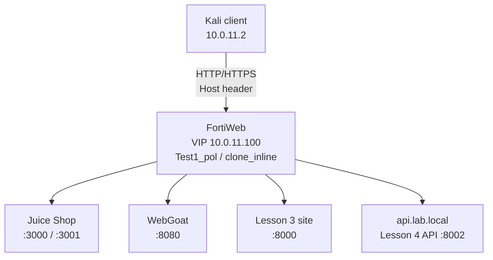

# Lesson 04 - API Protection

> Lab status: Complete  
> Documentation status: Complete  
> Completed: 2026-07-08  
> Depends on: [Lessons 01-03](../03-web-application-protection/README.md)

## 1. Scope

Lesson 4 extended the same application-delivery system into API protection. A deterministic API was added behind the existing VIP and protected with JSON, XML, GraphQL, OpenAPI, method/access, and rate-limit controls.

No separate VIP or isolated policy was created. Juice Shop, WebGoat, the Lesson 3 test site, and the new API all continued through `10.0.11.100`, `Vip1`, `Test1_pol`, and `clone_inline`.

## 2. Integrated architecture



### New routing objects

| Object | Value |
| --- | --- |
| API hostname | `api.lab.local` |
| Server pool | `pool_api_lesson4` -> `10.0.20.2:8002` |
| Content route | `route_api_lesson4`, Host `api.lab.local` -> API pool |
| Server policy | Existing `Test1_pol` |
| Virtual server | Existing `Vip1` / `10.0.11.100` |
| Protection profile | Existing `clone_inline` |
| Client hosts line | `10.0.11.100 juice.lab.local webgoat.lab.local urlenc.lab.local api.lab.local` |

## 3. Controlled API backend

The backend used Python `BaseHTTPRequestHandler` on `0.0.0.0:8002`. Port `8002` was chosen after a conflict with an existing service around port `8001` in the actual lab state.

| Method | Endpoint | Purpose | Normal result |
| --- | --- | --- | --- |
| GET | `/health` | Health and route validation | `200` with status `ok` |
| GET | `/openapi.json` | OpenAPI source | `200` with OpenAPI JSON |
| POST | `/api/register` | Registration JSON Schema target | `201` for valid JSON |
| POST | `/api/login` | JWT issuance and rate-limit target | `200` for valid lab credentials; `401` otherwise |
| GET | `/api/profile` | JWT-protected profile | `200` with valid token; `401` missing/invalid |
| GET | `/api/users/{id}` | Path-parameter contract target | `200` for numeric ID |
| POST | `/api/xml/upload` | XML Schema and XXE target | `200` for accepted XML |
| POST | `/graphql` | GraphQL-control target | `200` for normal query |

Reproducible source and schemas are under [`../../vuln-sites/lesson4-api/`](../../vuln-sites/lesson4-api/README.md).

```bash
mkdir -p ~/lesson4-api
cd ~/lesson4-api
nohup python3 api_server.py > api_server.log 2>&1 &
sleep 1
sudo ss -lntp | grep ':8002'

curl -i http://127.0.0.1:8002/health
curl -i -X POST http://127.0.0.1:8002/api/register \
  -H "Content-Type: application/json" \
  --data '{"username":"kady","email":"kady@example.com","password":"Pass123!","age":22}'
curl -i -X POST http://127.0.0.1:8002/api/login \
  -H "Content-Type: application/json" \
  --data '{"username":"kady","password":"Pass123!"}'
```

Observed local result: port `8002` listened; `/health` returned `200`, registration returned `201`, and login returned a JWT.

## 4. FortiWeb routing integration

1. Create `pool_api_lesson4` with `10.0.20.2:8002`.
2. Add `api.lab.local` as an accepted protected hostname.
3. Create `route_api_lesson4` matching Host `api.lab.local` and selecting the API pool.
4. Add the route to `Test1_pol` without changing the VIP.
5. Add the hostname to Kali's `/etc/hosts` entry.
6. Validate through FortiWeb before enabling API protections.

```bash
curl -i http://api.lab.local/health
curl -i -H "Host: api.lab.local" http://10.0.11.100/health
curl -i -X POST http://api.lab.local/api/register \
  -H "Content-Type: application/json" \
  --data '{"username":"kady","email":"kady@example.com","password":"Pass123!","age":22}'
```

Observed result: health returned `200`, valid registration returned `201`, and FortiWeb injected `cookiesession1`, confirming the request used the active policy path.

## 5. Baseline JWT behavior

```bash
TOKEN=$(curl -s -X POST http://api.lab.local/api/login \
  -H "Content-Type: application/json" \
  --data '{"username":"kady","password":"Pass123!"}' \
  | python3 -c 'import json,sys; print(json.load(sys.stdin)["token"])')

# Valid token
curl -i http://api.lab.local/api/profile \
  -H "Authorization: Bearer $TOKEN"

# Missing token
curl -i http://api.lab.local/api/profile

# Invalid token
curl -i http://api.lab.local/api/profile \
  -H "Authorization: Bearer fake.invalid.token"
```

| Test | Result |
| --- | --- |
| Valid JWT | `200 OK` with profile/claims |
| Missing JWT | Backend `401 Unauthorized` |
| Fake JWT | Backend `401 Unauthorized` |
| FortiWeb mobile/JWT validation | Not exposed in the tested GUI; not falsely claimed |

The baseline separated backend authentication failures from later FortiWeb enforcement.

## 6. ML/API discovery attempt

The ML/API Protection policy was created under `Test1_pol`; `api.lab.local` showed Running, but API Collection stayed at `0`.

```bash
for i in {1..20}; do
  curl -s -o /dev/null http://api.lab.local/health
  curl -s -o /dev/null http://api.lab.local/openapi.json
  curl -s -o /dev/null -X POST http://api.lab.local/api/register \
    -H "Content-Type: application/json" \
    --data '{"username":"kady","email":"kady@example.com","password":"Pass123!","age":22}'
  curl -s -o /dev/null -X POST http://api.lab.local/api/login \
    -H "Content-Type: application/json" \
    --data '{"username":"kady","password":"Pass123!"}'
  curl -s -o /dev/null http://api.lab.local/api/users/1
  curl -s -o /dev/null -X POST http://api.lab.local/graphql \
    -H "Content-Type: application/json" \
    --data '{"query":"{ user { id username } }"}'
done
```

Final status: policy creation tested; collection unavailable in the trial/image state; manual API protections continued.

## 7. JSON Protection

### Objects

| Object type | Name | Settings |
| --- | --- | --- |
| JSON Schema | `json_schema_register_lesson4` | Draft-07 file `register_schema_lesson4.json` |
| JSON Schema Group | `jsg_register_lesson4` | Contains the registration schema |
| JSON Rule | `json_rule_register_lesson4` | Host `api.lab.local`, POST `/api/register`, schema group, Alert then Alert & Deny |
| JSON Policy | `policy_l4` | Contains the rule |
| Attachment | `clone_inline` | JSON Protection Policy set to `policy_l4` |

### Valid and invalid requests

```bash
# Valid - allowed
curl -i -X POST http://api.lab.local/api/register \
  -H "Content-Type: application/json" \
  --data '{"username":"kady","email":"kady@example.com","password":"Pass123!","age":22}'

# Missing required age
curl -i -X POST http://api.lab.local/api/register \
  -H "Content-Type: application/json" \
  --data '{"username":"kady","email":"kady@example.com","password":"Pass123!"}'

# Wrong age type
curl -i -X POST http://api.lab.local/api/register \
  -H "Content-Type: application/json" \
  --data '{"username":"kady","email":"kady@example.com","password":"Pass123!","age":"twenty"}'

# Extra privilege field
curl -i -X POST http://api.lab.local/api/register \
  -H "Content-Type: application/json" \
  --data '{"username":"kady","email":"kady@example.com","password":"Pass123!","age":22,"role":"admin"}'
```

The invalid requests initially created users and produced no attack logs because `policy_l4` existed but was not attached to the active `clone_inline` profile. After attaching it and re-saving `Test1_pol`, violations were detected. Changing the rule to Alert & Deny blocked them while valid JSON remained allowed.

## 8. XML Protection and XXE

### Objects and limits

| Object/setting | Value |
| --- | --- |
| XML Schema | `xml_schema_user_lesson4`, uploaded from `user_upload_lesson4.xsd` |
| XML Rule | `xml_rule_upload_lesson4`, Host `api.lab.local`, URL `/api/xml/*` |
| XML Policy | `xml_policy_lesson4`, attached to `clone_inline` |
| Maximum attributes | 32 |
| Attribute name/value lengths | 64 / 1024 |
| CDATA length | 4096 |
| Element depth/name length | 5 / 64 |
| Forbidden XML Entities | Enabled |

```bash
# Valid XML
curl -i -X POST http://api.lab.local/api/xml/upload \
  -H "Content-Type: application/xml" \
  --data '<user><name>kady</name><id>1</id></user>'

# Schema violation
curl -i -X POST http://api.lab.local/api/xml/upload \
  -H "Content-Type: application/xml" \
  --data '<user><name>kady</name><id>abc</id></user>'

# Malformed XML
curl -i -X POST http://api.lab.local/api/xml/upload \
  -H "Content-Type: application/xml" \
  --data '<user><name>kady</id></user>'

# XXE/entity payload
curl -i -X POST http://api.lab.local/api/xml/upload \
  -H "Content-Type: application/xml" \
  --data '<!DOCTYPE foo [<!ENTITY xxe SYSTEM "file:///etc/passwd">]><user><name>&xxe;</name><id>1</id></user>'
```

Observed result: invalid XML, malformed XML, and the XXE payload were detected in Alert mode and denied after enforcement; valid XML remained allowed.

## 9. GraphQL Protection

Several FortiWeb GraphQL toggles mean allow when enabled. Introspection and fragments were therefore disabled so their use became a violation.

| Setting | Final value |
| --- | --- |
| Host / URL | `api.lab.local` / `/graphql` |
| Alias batching | Enabled, limit 8 |
| Array batching | Enabled, limit 8 |
| Introspection queries | Disabled |
| Fragments | Disabled |
| Action | Alert, then Alert & Deny |

```bash
# Valid query
curl -i -X POST http://api.lab.local/graphql \
  -H "Content-Type: application/json" \
  --data '{"query":"{ user { id username } }"}'

# Introspection
curl -i -X POST http://api.lab.local/graphql \
  -H "Content-Type: application/json" \
  --data '{"query":"{ __schema { queryType { name } } }"}'

# Fragment
curl -i -X POST http://api.lab.local/graphql \
  -H "Content-Type: application/json" \
  --data '{"query":"fragment UserFields on User { id username } query { user { ...UserFields } }"}'

# Deep/abnormal query
curl -i -X POST http://api.lab.local/graphql \
  -H "Content-Type: application/json" \
  --data '{"query":"{ a { b { c { d { e { f { g } } } } } } }"}'
```

Observed result: the normal query passed; introspection, fragment, and bad/deep cases were detected and blocked.

## 10. OpenAPI Validation

| Object type | Name | Settings |
| --- | --- | --- |
| Definition | `openapi_lesson4` | Uploaded `openapi_lesson4.json` |
| Rule | `openapi_rule_lesson4` | Host `api.lab.local`, URL `/*`, selected definition |
| Policy | `openapi_policy_lesson4` | Attached to `clone_inline` |
| Action | Alert, then Alert & Deny |

```bash
# Known path/method
curl -i http://api.lab.local/api/users/1

# Unknown path
curl -i http://api.lab.local/api/admin/deleteEverything

# Wrong method
curl -i -X DELETE http://api.lab.local/api/users/1

# Wrong body shape
curl -i -X POST http://api.lab.local/api/register \
  -H "Content-Type: application/json" \
  --data '{"unexpected":"field"}'
```

Observed result: the defined path/method remained allowed; unknown paths, wrong methods, and contract-invalid bodies were denied after enforcement.

## 11. Access control and API hygiene

The API needed only GET, POST, and OPTIONS on its defined paths. TRACE, DELETE, PUT, PATCH, and CONNECT were denied unless explicitly required.

```bash
curl -i -X TRACE http://api.lab.local/api/register
curl -i -X DELETE http://api.lab.local/api/users/1
curl -i -X PUT http://api.lab.local/api/register
```

Observed result: abnormal methods were blocked. JSON endpoints used `application/json`; the XML endpoint accepted `application/xml`/`text/xml`; OpenAPI reinforced expected paths and methods.

## 12. HTTP Access Limit / rate limiting

| Setting | Value |
| --- | --- |
| Feature | DoS Protection -> Application -> HTTP Access Limit |
| Rule | `rate_login_lesson4` |
| Host / URL | `api.lab.local` / `/api/login` |
| Method | POST where available |
| Client identifier | Source/Client IP |
| Lab threshold | 5 requests per 10 seconds |
| Action | Alert & Deny |
| DoS policy | `dos_policy_lesson4` attached to `Test1_pol` |

```bash
for i in {1..20}; do
  curl -s -o /dev/null -w "$i %{http_code}\n" \
    -X POST http://api.lab.local/api/login \
    -H "Content-Type: application/json" \
    --data '{"username":"bad","password":"bad"}'
done
```

Observed result: early requests reached the backend and returned `401`; later requests were blocked/rate-limited after the configured threshold.

## 13. Final regression validation

```bash
# Earlier lessons
curl -I http://juice.lab.local
curl -I http://webgoat.lab.local/WebGoat/
curl -I http://urlenc.lab.local/public/lwjs.html

# API health and valid registration
curl -i http://api.lab.local/health
curl -i -X POST http://api.lab.local/api/register \
  -H "Content-Type: application/json" \
  --data '{"username":"kady","email":"kady@example.com","password":"Pass123!","age":22}'

# Valid JWT flow
TOKEN=$(curl -s -X POST http://api.lab.local/api/login \
  -H "Content-Type: application/json" \
  --data '{"username":"kady","password":"Pass123!"}' \
  | python3 -c 'import json,sys; print(json.load(sys.stdin)["token"])')
curl -i http://api.lab.local/api/profile \
  -H "Authorization: Bearer $TOKEN"

# Valid GraphQL
curl -i -X POST http://api.lab.local/graphql \
  -H "Content-Type: application/json" \
  --data '{"query":"{ user { id username } }"}'
```

| Route/control | Final result |
| --- | --- |
| Juice Shop | Still functional |
| WebGoat | Functional/normal redirect or login response |
| Lesson 3 test site | Still functional |
| API health | `200 OK` |
| Valid registration | `201 Created` |
| Valid profile with JWT | `200 OK` |
| Valid GraphQL query | `200 OK` |

## 14. Troubleshooting and lessons learned

| Issue | Root cause | Fix/lesson |
| --- | --- | --- |
| Separate VIP initially suggested | Isolation idea conflicted with the integrated-lab goal | Retain the single `10.0.11.100` VIP |
| Port `8001` conflict | Existing lab service already used the port | Move Lesson 4 API to `8002` |
| Backend prompt appeared as Kali | Client and backend nodes were both Kali-based | Identify machines by topology/IP role, not shell hostname |
| ML collection remained zero | Trial/image feature limitation | Record partial status and continue with manual controls |
| Invalid JSON still created users | `policy_l4` was not attached to `clone_inline` | Attach policy, re-save `Test1_pol`, then change Alert to Alert & Deny |
| GraphQL toggle confusion | Introspection/fragments toggles mean allowed when on | Turn them off to make their use a violation |
| Mobile/JWT control absent | Feature not exposed in the current GUI | Validate backend JWT honestly; mark FortiWeb JWT unavailable |

## 15. Final status

| Area | Status |
| --- | --- |
| API backend and shared-VIP routing | Complete |
| JSON Protection | Complete |
| XML/XSD/XXE Protection | Complete |
| GraphQL Protection | Complete |
| OpenAPI Validation | Complete |
| Method/access hygiene | Complete |
| HTTP Access Limit | Complete |
| ML/API discovery | Partial; running but collection stayed zero |
| FortiWeb mobile/JWT validation | Unavailable in the tested GUI; backend JWT complete |

Lesson 4 completed a single integrated web-and-API protection system rather than a collection of disconnected mini-labs.

