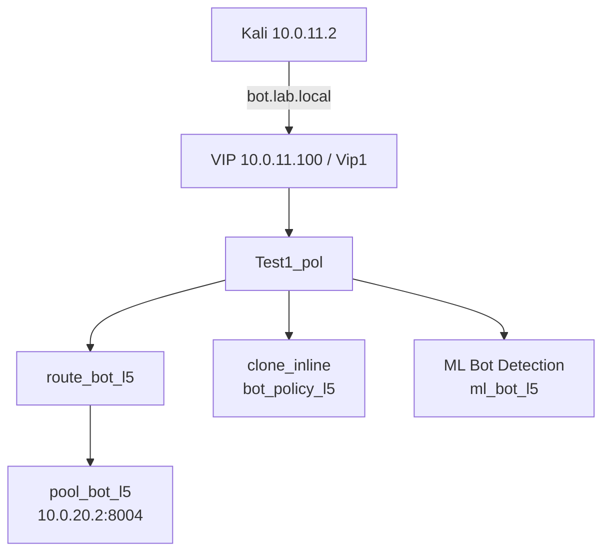

# Lesson 5 - Bot Mitigation

## Scope and result

Lesson 5 adds bot-aware detection to the existing FortiWeb lab. It distinguishes interactive-browser behavior from scripted automation, detects repeated crawling and content scraping, classifies known crawler/scanner behavior, and trains an ML model for behavior that deviates from a clean browser baseline.

This remains an integrated change. `Vip1`, VIP `10.0.11.100`, `Test1_pol`, and `clone_inline` remain in use; no standalone Lesson 5 VIP or server policy was created.

| Area | Reported outcome | Evidence boundary |
| --- | --- | --- |
| Backend/routing | `bot.lab.local` reached `10.0.20.2:8004` through the shared VIP | Local/routed login captures support the baseline and policy path; no route/pool GUI capture supplied |
| Biometric | Interactive browser worked; fresh curl created a biometric event and was denied during temporary enforcement | Event log/configuration are captured; deny/recovery is report-recorded |
| Threshold | Repeated 404s and rapid product reads created threshold events; temporary blocking was tested | Event log/configuration are captured; block/recovery is report-recorded |
| Known Bots | Wget scraping, Nikto scanner classification, and spoofed crawler identity were exercised | Configuration/log capture supports the control; tool-to-row mapping is report-recorded |
| ML | Clean browser model trained; neutral automation was detected and denied during temporary enforcement | Configuration capture/report only; no ML event or final-model-status capture supplied |
| Regression | Lesson 5 and prior applications remained reachable | Report-recorded; safe scripts reproduce route checks |

## Architecture delta



| Object | Lesson 5 value | Purpose |
| --- | --- | --- |
| Backend hostname | `bot.lab.local` | Host header accepted on the existing VIP |
| Backend process | Python `ThreadingHTTPServer`, `0.0.0.0:8004` | Deterministic bot-testing service |
| Health check/pool | `hc_bot_l5_http` / `pool_bot_l5` | `GET /health` expected `200`; `10.0.20.2:8004`, backend SSL off |
| Content route | `route_bot_l5` | Host -> `pool_bot_l5` |
| Conventional bot policy | `bot_policy_l5` | Holds biometric, threshold, and known-bot controls in `clone_inline` |
| ML policy | `ml_bot_l5` | Separate Machine Learning path in `Test1_pol` |

```text
10.0.11.100 juice.lab.local webgoat.lab.local urlenc.lab.local api.lab.local delivery.lab.local reports.lab.local bot.lab.local
```

## Controlled backend implementation

The prior vulnerable applications were retained, but bot testing needed predictable status codes, crawlable links, a controlled login flow, browser-interaction JavaScript, mixed HTML/JSON paths, and request logging. The complete backend is under [`../../vuln-sites/lesson5-bot/`](../../vuln-sites/lesson5-bot/README.md).

```bash
cd vuln-sites/lesson5-bot
chmod +x bot_server.py
nohup python3 bot_server.py > bot_server.log 2>&1 &
echo $! > bot_server.pid
sleep 1
sudo ss -lntp | grep ':8004'
curl -i http://127.0.0.1:8004/health
curl -i -X POST http://127.0.0.1:8004/login -H 'Content-Type: application/json' --data '{"username":"demo","password":"FortiWeb123!"}'
curl -i -X POST http://127.0.0.1:8004/login -H 'Content-Type: application/json' --data '{"username":"bad","password":"bad"}'
```

The direct backend baseline returns `200`/`authenticated` for `demo` / `FortiWeb123!` and `401`/`denied` for bad credentials. The source is a lab-only credential. [05-backend-direct-login-baseline.png](evidence/05-backend-direct-login-baseline.png) directly shows both local responses.

| Endpoint | Purpose | Used by |
| --- | --- | --- |
| `/`, `/search`, `/login` | Interactive HTML and clean training pages | Browser/biometric/ML training |
| `/health` | JSON health | Pool health and post-block recovery |
| `/products`, `/product/1` ... `/product/20` | Crawlable HTML catalogue | Wget and content-scraping threshold |
| `/missing/*`, `/forbidden` | Controlled `404` / `403` | Crawler/error threshold |
| `/api/items` | JSON response | Mixed ML automation |
| `/headers` | TCP peer, XFF, UA, headers, cookie names | Proxy/client-identity inspection |
| `/robots.txt`, `/slow` | Crawler guidance and two-second response | Automated/timing behavior |

Every request is logged with timestamp, TCP client, `X-Forwarded-For`, method, path, User-Agent, and cookie. The report records routed traffic as backend TCP client `10.0.20.1` with `X-Forwarded-For` `10.0.11.2`.

## FortiWeb integration and baseline

1. Create `hc_bot_l5_http`: HTTP `GET /health`, expected `200`.
2. Create `pool_bot_l5` with `10.0.20.2:8004`, backend SSL disabled, and the health check.
3. Add `bot.lab.local` with Accept action to the active protected-hostname object.
4. Create `route_bot_l5` for Host `bot.lab.local` -> `pool_bot_l5`.
5. Add the route to `Test1_pol`; do not replace its existing routes or add a VIP.
6. Add the client hosts mapping shown above.
7. Validate public routing before adding bot controls.

```bash
curl -i -H 'Host: bot.lab.local' http://10.0.11.100/health
curl -i http://bot.lab.local/health
curl -s http://bot.lab.local/headers | python3 -m json.tool
curl -i -X POST http://bot.lab.local/login -H 'Content-Type: application/json' --data '{"username":"demo","password":"FortiWeb123!"}'
```

[05-routed-login-session-proof.png](evidence/05-routed-login-session-proof.png) directly shows the routed valid login returning `200` from `Lesson5BotBackend/1.0` with FortiWeb `cookiesession1`. It proves the active policy path, but not the FortiWeb object pages themselves.

## Attachment chain

```text
Test1_pol
  +-- route_bot_l5 -> pool_bot_l5 -> 10.0.20.2:8004
  +-- clone_inline -> bot_policy_l5
  |                    +-- biometric_l5
  |                    +-- threshold_l5
  |                    +-- known_bots_l5
  +-- Machine Learning -> ml_bot_l5
```

`bot_policy_l5` is selected by `clone_inline`. `ml_bot_l5` is deliberately a separate `Test1_pol` Machine Learning attachment, not a `clone_inline` child. All controls began in Alert; the report records short Alert & Deny proof, then return to Alert for shared-lab usability. See [`configs/bot-mitigation-settings.md`](configs/bot-mitigation-settings.md) for full values and evidence reconciliation.

## Bot controls, attacks, and observed result

### Biometric-Based Detection

`biometric_l5` evaluates browser JavaScript and interaction. The report records mouse movement, focus, click, keyboard, scroll, Bot Trait Checking `2`, collection `10 s`, report wait `10 s`, effective time `60 s`, High severity, and `bot.lab.local` / `/` scope.

```bash
rm -f /tmp/l5-bio.cookies
curl -i -c /tmp/l5-bio.cookies -A 'curl-biometric-test/1.0' http://bot.lab.local/
sleep 12
curl -i -b /tmp/l5-bio.cookies -A 'curl-biometric-test/1.0' http://bot.lab.local/
```

An interactive browser was used to move, click, type, scroll, and navigate; it stayed functional. A fresh curl client did not execute the browser-side logic. In Alert, it generated `Biometrics Based Detection` under `Test1_pol`; during temporary enforcement the report records denial, followed by browser regression success. [05-biometric-detection-settings.png](evidence/05-biometric-detection-settings.png) shows the settings; [05-biometric-and-threshold-attack-log.png](evidence/05-biometric-and-threshold-attack-log.png) shows the event. Denial/recovery is report-recorded rather than directly visible in the capture.

### Threshold-Based Detection

`threshold_l5` tracks Client IP. The report records Crawler Detection at `5` events in `10 s` and Content Scraping Detection at `8` retrievals in `15 s`, both High and Alert.

```bash
for i in {1..8}; do curl -s -o /dev/null -w "request=$i status=%{http_code}\n" "http://bot.lab.local/missing/page-$i"; done
for i in {1..12}; do curl -s -o /dev/null -w "product=$i status=%{http_code}\n" "http://bot.lab.local/product/$i"; done
```

The `404` sequence generated a threshold event and the report records temporary block validation/recovery (`/health` returned `200` afterward). Rapid product retrieval generated Content Scraping/Threshold evidence; backend logs recorded `/product/1` through `/product/12`. [05-threshold-detection-settings.png](evidence/05-threshold-detection-settings.png) directly verifies Client IP, `5/10 s`, `8/15 s`, Alert, and High. It also shows Vulnerability Scanning Detection enabled at `100/10 s`, but the report provides no separate test/final-state claim for that subfeature, so this repository does not claim it as independently validated.

### Web Crawlers and Known Bots

```bash
wget --recursive --level=2 --no-parent --no-host-directories --directory-prefix=/tmp/l5-wget-crawl --user-agent='Wget/1.21.4 FortiWeb-Lesson5' http://bot.lab.local/
nikto -h http://bot.lab.local
curl -i -A 'Mozilla/5.0 (compatible; Googlebot/2.1; +http://www.google.com/bot.html)' http://bot.lab.local/products
```

Wget generated recursive scraping traffic; Nikto was detected as a malicious scanner; and the Googlebot-style User-Agent exercised crawler identity handling without treating a User-Agent claim as automatic trust. The report records temporary Alert & Deny proof for the matching bot/scanner and normal-browser regression. [05-known-bots-action-settings.png](evidence/05-known-bots-action-settings.png) directly shows malicious categories in `Alert & Deny` and captured Known Good Bots `Bypass`; [05-known-bots-attack-log.png](evidence/05-known-bots-attack-log.png) directly shows multiple `Known Bots Detection` events under `Test1_pol` from `10.0.11.2`. The screenshot alone cannot associate each log row with Wget, Nikto, or the spoofed request.

### ML-Based Bot Detection

`ml_bot_l5` was trained only on clean graphical-browser HTML `200` activity across `/`, `/products`, `/product/1`, `/product/2`, `/product/3`, `/login`, and `/search?q=camera`. Crawlers, errors, and bursts were excluded. The report records source `10.0.11.2/32`, IP + User-Agent identity, one-minute vectors, 20 samples/client/hour, initial target 10, Moderate model, Real Browser Enforcement, model reaching a working state, neutral automation Alert evidence, temporary denial, and browser regression.

```bash
BASE_URL='http://bot.lab.local'; COOKIE_FILE='/tmp/l5-ml.cookies'; USER_AGENT='Lesson5-NeutralAutomation/1.0'
paths=( '/' '/products' '/product/1' '/api/items' '/product/2' '/search?q=automation' '/login' )
rm -f "$COOKIE_FILE"
for i in $(seq 1 32); do index=$(( (i - 1) % ${#paths[@]} )); path="${paths[$index]}"; curl -sS -b "$COOKIE_FILE" -c "$COOKIE_FILE" -A "$USER_AGENT" -o /dev/null -w "request=$i path=$path code=%{http_code} time=%{time_total}s\n" "${BASE_URL}${path}"; sleep 5; done
```

Critical discrepancy: [05-ml-bot-model-settings.png](evidence/05-ml-bot-model-settings.png) shows anomaly count `1` and dynamic updates enabled, but the final report records anomaly threshold `2` and dynamic updates disabled during the anomaly test. No ML Attack-log or final model-status capture was supplied. Both records are preserved; no unsupported single final ML setting is asserted.

## Validation, regression, and troubleshooting

```bash
bash scripts/validation/lesson-05.sh
bash scripts/attacks/lesson-05.sh biometric
bash scripts/attacks/lesson-05.sh threshold
bash scripts/attacks/lesson-05.sh known-bots
bash scripts/attacks/lesson-05.sh ml
bash scripts/validation/smoke-test.sh
```

The validation script is safe: it proves the private-VIP route, session cookie, valid/invalid backend login behavior, and header endpoint. It does not claim a live bot event. The attack helper reproduces report traffic only and rejects a non-private VIP; inspect Attack logs and choose Alert/Alert & Deny deliberately.

| Symptom | Check/fix |
| --- | --- |
| Host does not resolve | Map `bot.lab.local` to `10.0.11.100`; run `getent hosts bot.lab.local` |
| Pool down | Check service/port, `curl 10.0.20.2:8004/health`, and `hc_bot_l5_http` |
| Backend works but VIP fails | Verify hostname Accept action, `route_bot_l5`, route destination, and `Test1_pol` list |
| No bot logs | Verify `bot_policy_l5 -> clone_inline -> Test1_pol` and save state |
| Biometric does not fire | Fresh cookie jar/non-JavaScript client; wait through collection/report period |
| Threshold does not fire | Confirm Client IP tracking, rate/window values, and rapid unique requests |
| Known bot unclassified | Confirm intelligence state and inspect detailed Known Bots log; use documented Wget/Nikto traffic |
| ML samples remain zero | Use clean graphical-browser HTML `200` requests and confirm source scope |
| ML blocks normal user | Return to Alert, retrain with clean samples, retain Moderate model, rebuild carefully |

## Evidence index

| File | Direct proof | Limit |
| --- | --- | --- |
| [05-backend-direct-login-baseline.png](evidence/05-backend-direct-login-baseline.png) | Local valid `200` / invalid `401` | No WAF proof |
| [05-routed-login-session-proof.png](evidence/05-routed-login-session-proof.png) | Routed `200`, backend banner, `cookiesession1` | No route/pool config page |
| [05-biometric-detection-settings.png](evidence/05-biometric-detection-settings.png) | Biometric settings, Alert, High | Scope/deny report-recorded |
| [05-biometric-and-threshold-attack-log.png](evidence/05-biometric-and-threshold-attack-log.png) | Biometric and threshold log rows | No command/block-response mapping |
| [05-threshold-detection-settings.png](evidence/05-threshold-detection-settings.png) | Threshold values/action | Extra scanning subfeature unvalidated |
| [05-known-bots-action-settings.png](evidence/05-known-bots-action-settings.png) | Enforcement capture | Not final Alert reversion |
| [05-known-bots-attack-log.png](evidence/05-known-bots-attack-log.png) | Known Bots log rows | Tool attribution report-recorded |
| [05-ml-bot-model-settings.png](evidence/05-ml-bot-model-settings.png) | ML settings at capture | Conflicts with final report; no ML result capture |

## Rollback and final status

Remove `route_bot_l5`, the hostname, the bot-policy attachment, and `ml_bot_l5` only after disabling the controls; then stop the `:8004` backend if no longer needed. Do not alter `VIP1`, `Vip1`, `Test1_pol`, `clone_inline`, or previous routes/backends.

Lesson 5 is complete for the supplied report scope. Biometric evidence, behavior thresholds, known-bot intelligence, and ML anomaly detection are complementary signals, not interchangeable DoS controls.
