# Lesson 06 - Application Delivery

> Lab status: Complete<br>
> Documentation status: Complete<br>
> Completed: 2026-07-13<br>
> Depends on: [Lessons 01-04](../04-api-protection/README.md)

## 1. Scope

Lesson 6 extended the existing FortiWeb lab from web/API protection into application delivery and identity-aware publishing. A controlled backend was added on TCP `8003`, then URL transformation, LDAP-backed authentication, SSO, compression, caching, acceleration, Lua scripting, and Waiting Room controls were layered onto the same integrated traffic path.

No separate VIP or isolated server policy was created. The lesson retained:

- VIP `10.0.11.100`
- Virtual server `Vip1`
- Server policy `Test1_pol`
- Web Protection Profile `clone_inline`
- Host-header content routing
- Backend host `10.0.20.2`

The course numbering is preserved; this repository does not invent a Lesson 5 folder when that lesson has not been published here.

### Completion criteria

| Area | Required result | Final status |
| --- | --- | --- |
| Backend/routing | Both Lesson 6 hostnames reach `10.0.20.2:8003` through the shared VIP | Complete |
| Redirect | `/old` receives a FortiWeb-generated `302` to `/new` | Complete |
| Internal rewrite | Client requests `/legacy/page`; backend receives `/modern/page` | Complete |
| Response rewrite | Private backend `Location` becomes the public hostname | Complete |
| Site Publishing | `/private/` is gated by FortiWeb HTML-form authentication | Complete |
| SSO | One login covers both `delivery.lab.local` and `reports.lab.local` | Complete |
| Compression | Eligible text is returned with gzip when requested | Complete |
| Caching | Repeated eligible static requests do not all reach the backend | Complete |
| Acceleration | HTML/JS/CSS/image optimization is active without changing source files | Complete |
| Lua | `delivery.lab.local` responses contain `X-Lesson6-Lua: active` | Complete |
| Waiting Room | A second independent `/sale` visitor is queued at capacity | Complete |

## 2. Correlation with Lessons 01-04

Lesson 6 follows the same incremental method used throughout the repository: first make the backend reachable, then add one control, prove the changed traffic behavior, and re-test the existing applications.

| Prior lesson | Reused foundation | Lesson 6 extension |
| --- | --- | --- |
| Lessons 01-02 | Interfaces, `10.0.11.100`, `Vip1`, `Test1_pol`, protected hostnames, pools, health checks, content routing, HTTPS offload, persistence, XFF | Adds two hostnames, one pool, and two routes to the same delivery path |
| Lesson 03 | `clone_inline` and the child-policy attachment model | URL rewriting, compression, and Waiting Room are selected through the active profile |
| Lesson 04 | A controlled service on `:8002` added behind the same VIP | Uses the next controlled backend port, `:8003`, without creating a competing policy |

This distinction matters: several Lesson 6 objects can exist in the GUI without affecting traffic. The control becomes active only when its complete attachment chain reaches `Test1_pol`.

## 3. Integrated architecture

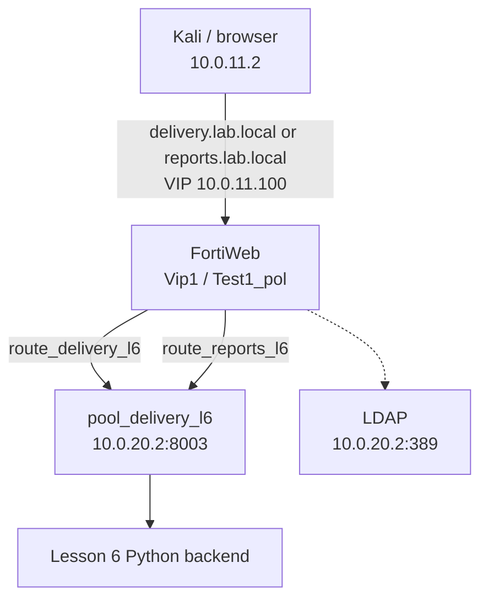

| Component | Value |
| --- | --- |
| Client | Kali `10.0.11.2/24`, gateway `10.0.11.1` |
| Client-side FortiWeb interface | `port2`, `10.0.11.1/24` |
| Shared VIP / virtual server | `10.0.11.100` / `Vip1` |
| Main server policy | `Test1_pol` |
| Web Protection Profile | `clone_inline` |
| Server-side FortiWeb interface | `port3`, `10.0.20.1/24` |
| Backend host | `10.0.20.2/24` |
| Lesson 6 service | `10.0.20.2:8003` |
| LDAP service | `10.0.20.2:389` |

## 4. Controlled backend implementation

A deterministic backend was required because delivery controls need known source/destination URLs, a deliberately private redirect header, public static resources, an authentication target, and a slow capacity-limited path.

The complete reproducible implementation is under [`../../vuln-sites/lesson6-delivery/`](../../vuln-sites/lesson6-delivery/README.md).

```bash
cd ~/lesson6-delivery
chmod +x delivery_server.py
nohup python3 delivery_server.py > delivery_server.log 2>&1 &
echo $! > delivery_server.pid

sudo ss -lntp | grep ':8003'
curl -i http://127.0.0.1:8003/
tail -f delivery_server.log
```

| Method | Path | Controlled behavior |
| --- | --- | --- |
| GET/HEAD | `/` | Main page and acceleration target |
| GET/HEAD | `/old` | Backend baseline before FortiWeb redirects it |
| GET/HEAD | `/new` | Public redirect destination |
| GET/HEAD | `/legacy/page` | Public source for the silent request rewrite |
| GET/HEAD | `/modern/page` | Backend destination for the silent request rewrite |
| GET/HEAD | `/backend-links` | Body containing deliberately private URLs |
| GET/HEAD | `/backend-redirect` | Backend `302` with `Location: http://10.0.20.2:8003/new` |
| GET/HEAD | `/private/` | Site Publishing and SSO target |
| GET/HEAD | `/counter` | Dynamic backend-hit counter |
| GET/HEAD | `/headers` | Headers and client address seen at the backend |
| GET/HEAD | `/slow` | Three-second response |
| GET/HEAD | `/sale` | Eight-second Waiting Room target |
| GET/HEAD | `/static/*` | Compression, cache, and acceleration resources |

The repository version preserves the report behavior while avoiding duplicate `Cache-Control` headers and generating `static/large.txt` deterministically on first startup.

## 5. Routing integration

The integration reused the same pipeline practiced in the earlier lessons:

```text
backend process
  -> HTTP health check
  -> server pool
  -> protected hostname
  -> content route
  -> existing Test1_pol
```

| Object | Final value |
| --- | --- |
| Health check | `hc_delivery_l6_http`, HTTP `GET /` |
| Server pool | `pool_delivery_l6` -> `10.0.20.2:8003` |
| Primary hostname/route | `delivery.lab.local` / `route_delivery_l6` |
| SSO hostname/route | `reports.lab.local` / `route_reports_l6` |
| Policy attachment | Both routes added to `Test1_pol` |

Client name resolution:

```text
10.0.11.100 juice.lab.local webgoat.lab.local urlenc.lab.local api.lab.local delivery.lab.local reports.lab.local
```

Baseline validation before enabling delivery controls:

```bash
# Direct backend
curl -i http://127.0.0.1:8003/

# Raw Host-header request through the VIP
curl -i -H 'Host: delivery.lab.local' http://10.0.11.100/

# Normal routed request
curl -i http://delivery.lab.local/
```

Observed result: the routed response was `200 OK`, contained the Lesson 6 page, and included FortiWeb's transaction cookie.

## 6. Rewriting and redirecting

Three transformations were deliberately separated because they occur at different points in the flow and produce different client-visible behavior.

### 6.1 FortiWeb-generated redirect: `/old` to `/new`

| Setting | Value |
| --- | --- |
| Rule | `rule1L6` |
| Action type | Request Action |
| Action | Redirect (`302 Temporary`) |
| Host condition | `^delivery\.lab\.local$` |
| URL condition | `^/old$` |
| Replacement | `http://delivery.lab.local/new` |
| Parent policy | `urlrewrite_policy_l6` |
| Attachment | URL Rewriting selected through `clone_inline` |

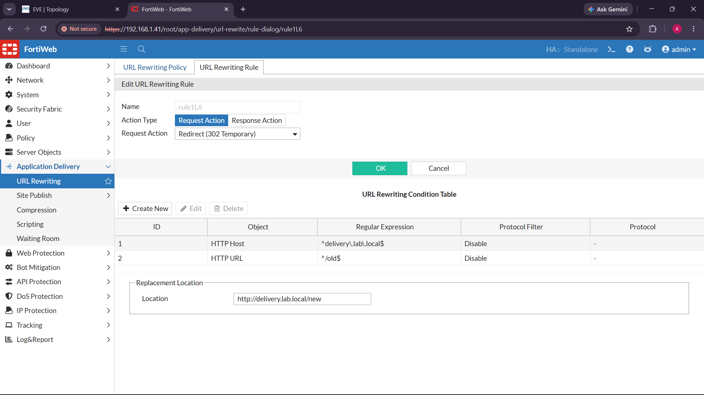

```bash
curl -i http://delivery.lab.local/old
curl -iL http://delivery.lab.local/old
```

Successful sequence:

```http
HTTP/1.1 302 Object moved
Location: http://delivery.lab.local/new

HTTP/1.1 200 OK
```

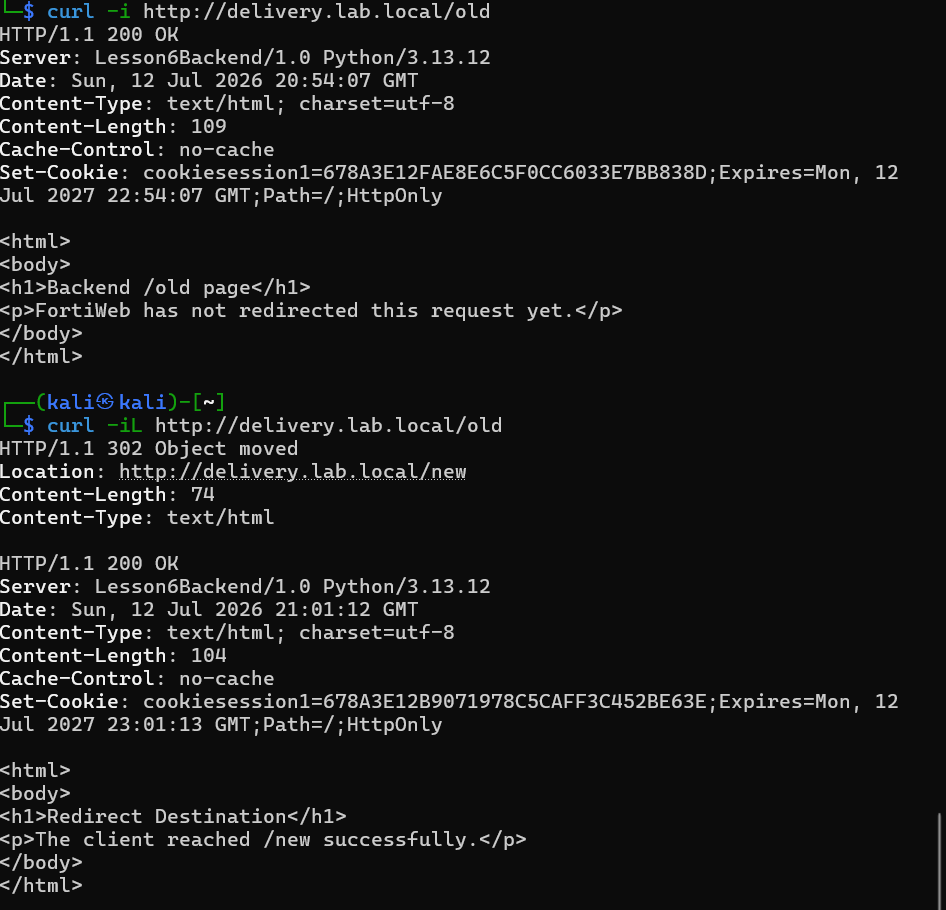

### 6.2 Silent internal request rewrite

| Setting | Value |
| --- | --- |
| Rule | `rewrite_legacy_to_modern_l6` |
| Action type | Request Action |
| Action | Rewrite HTTP Header / request URL |
| Conditions | Host `delivery.lab.local`, URL `^/legacy/page$` |
| Replacement URL | `/modern/page` |

```bash
curl -i http://delivery.lab.local/legacy/page
tail -n 20 ~/lesson6-delivery/delivery_server.log
```

Successful result:

- The client still requested `/legacy/page`.
- No `301`, `302`, or `Location` header was returned.
- The body contained `Modern Backend Page`.
- The backend log recorded `path=/modern/page`.

### 6.3 Response `Location` rewrite

The backend intentionally exposes its private address in a redirect. FortiWeb preserves the backend-generated `302` while replacing only the private `Location` value.

| Setting | Value |
| --- | --- |
| Rule | `rewrite_location_l6` |
| Action type | Response Action |
| Conditions | Host `^delivery\.lab\.local$`, URL `^/backend-redirect$` |
| Replacement status | Disabled; preserve the backend `302` |
| Replacement `Location` | `http://delivery.lab.local/new` |

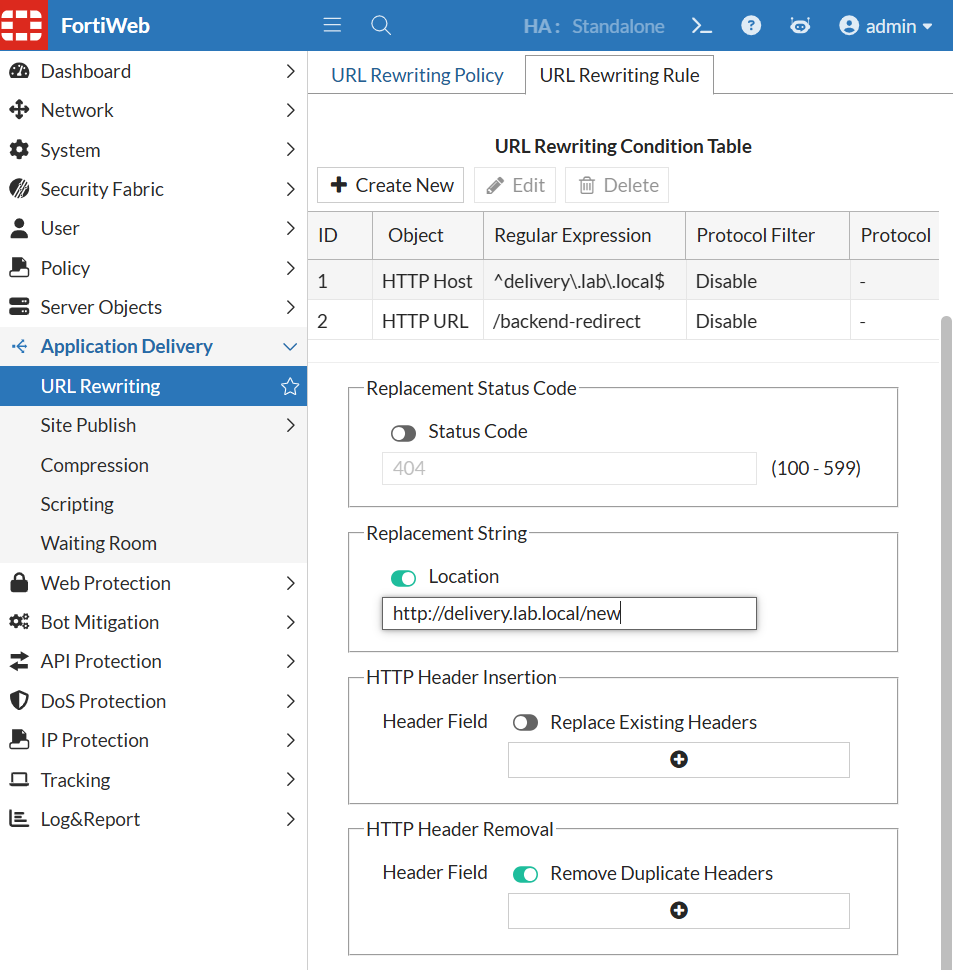

```bash
curl -i http://127.0.0.1:8003/backend-redirect
curl -i http://delivery.lab.local/backend-redirect
```

| Path | Direct backend | Through FortiWeb |
| --- | --- | --- |
| `/backend-redirect` | `Location: http://10.0.20.2:8003/new` | `Location: http://delivery.lab.local/new` |

This prevents a browser from leaving the WAF-protected path and avoids disclosing the private backend address.

## 7. Site Publishing and LDAP authentication

Site Publishing placed an authentication gateway in front of `/private/`. The backend contains no login form and never receives the user's password. FortiWeb intercepts the request, renders its HTML login page, validates the user through LDAP, creates the authenticated session, and only then forwards the original request.

### 7.1 LDAP identity source

The reproducible container and user-bootstrap script are under [`../../vuln-sites/lesson6-delivery/ldap/`](../../vuln-sites/lesson6-delivery/ldap/compose.yaml). Credentials are supplied at runtime through environment variables and are not committed.

```bash
cd vuln-sites/lesson6-delivery/ldap
export LDAP_ADMIN_PASSWORD='<LAB_ADMIN_PASSWORD>'
export LESSON6_USER_PASSWORD='<LAB_USER_PASSWORD>'
docker compose up -d
./bootstrap-user.sh
```

| LDAP item | Value |
| --- | --- |
| Server | `10.0.20.2:389` |
| Base DN | `dc=lab,dc=local` |
| Search base | `ou=people,dc=lab,dc=local` |
| Identifier | `uid` |
| Administrator DN | `cn=admin,dc=lab,dc=local` |
| Lab user DN | `uid=kady,ou=people,dc=lab,dc=local` |

This is clear-text LDAP on an isolated lab segment. Production deployment requires transport protection and production-grade identity lifecycle controls.

### 7.2 FortiWeb authentication objects

| Object | Value / purpose |
| --- | --- |
| LDAP query | `ldap_l6`, server `10.0.20.2:389`, identifier `uid` |
| Authentication server pool | `auth_pool_l6`, contains `ldap_l6` |
| Delivery publish rule | `first_site_pub`, host `delivery.lab.local`, path `/private/` |
| Client authentication | HTML Form Authentication |
| Delegation | No Delegation |
| Cookie timeout | 30 minutes |
| Policy attachment | Active Site Publish policy selected by `Test1_pol` |

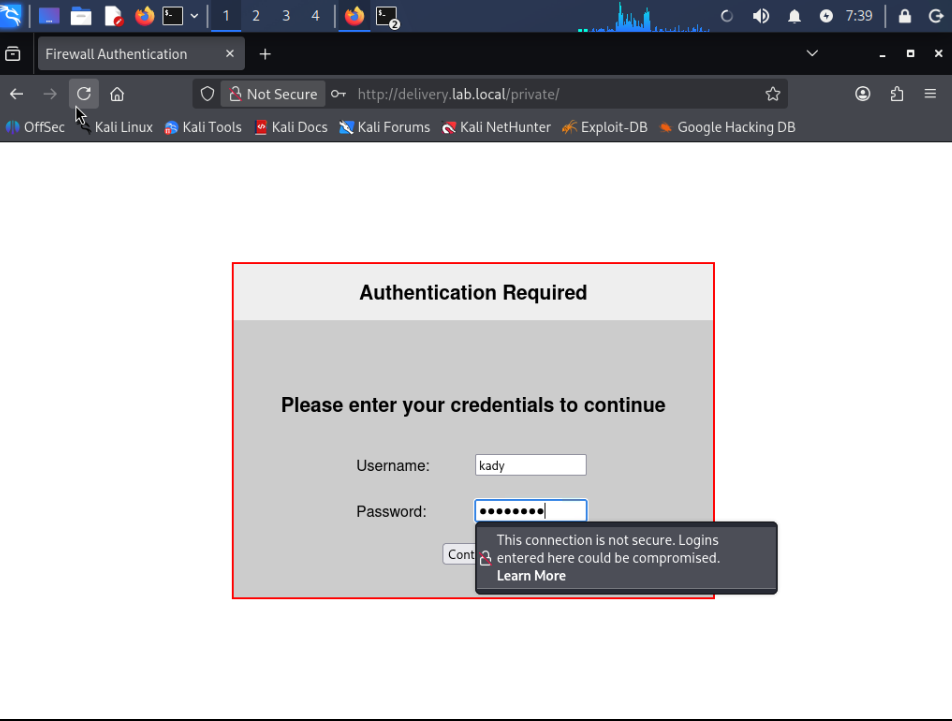

### 7.3 Positive and negative validation

| Test | Successful result |
| --- | --- |
| Unauthenticated `/private/` request | FortiWeb login page appears; backend page is not returned directly |
| Valid LDAP credentials | Private page opens |
| Invalid password | Login fails; backend access is not granted |
| Public `/`, `/new`, and static resources | Remain accessible without authentication |
| Backend role | No password or authentication logic added to Python |

The screenshot proves the authentication interception. Successful LDAP bind and post-login behavior were validated separately because a login-form screenshot alone does not prove identity validation.

## 8. Single Sign-On

`reports.lab.local` was added as a second published application pointing to the same backend pool. It has its own Site Publish rule but shares the LDAP pool and the `.lab.local` SSO domain.

1. Add `reports.lab.local` to protected hostnames and client name resolution.
2. Create `route_reports_l6` -> `pool_delivery_l6` and attach it to `Test1_pol`.
3. Create `reports_site_pub` for `reports.lab.local/private/` using `auth_pool_l6`.
4. Validate the pre-SSO baseline: each hostname requests a separate login.
5. Enable SSO on both Site Publish rules and set the shared domain to `.lab.local`.
6. Use a fresh browser session, log in to `delivery.lab.local/private/`, then open `reports.lab.local/private/`.

| State | Result |
| --- | --- |
| Before SSO | The second hostname prompts for credentials again |
| After SSO | One login opens both protected applications |
| Backend behavior | Backend remains unaware of passwords and SSO state |

Use separate clean/incognito sessions for before/after tests; stale FortiWeb cookies can make a broken SSO configuration appear successful.

## 9. Response compression

Compression reduced transferred bytes while preserving the response content.

| Setting | Value |
| --- | --- |
| Report label | `compress_l6` |
| Captured GUI object name | `policy1` |
| Type | Gzip |
| Content types | `text/html`, `text/plain`, `text/css`, `application/javascript`, `text/javascript` |
| Attachment | Compression selected through `clone_inline` |

The report and screenshot use different names for the same lab role. This write-up records the discrepancy instead of silently changing the evidence; object names are local labels and do not change the behavior.

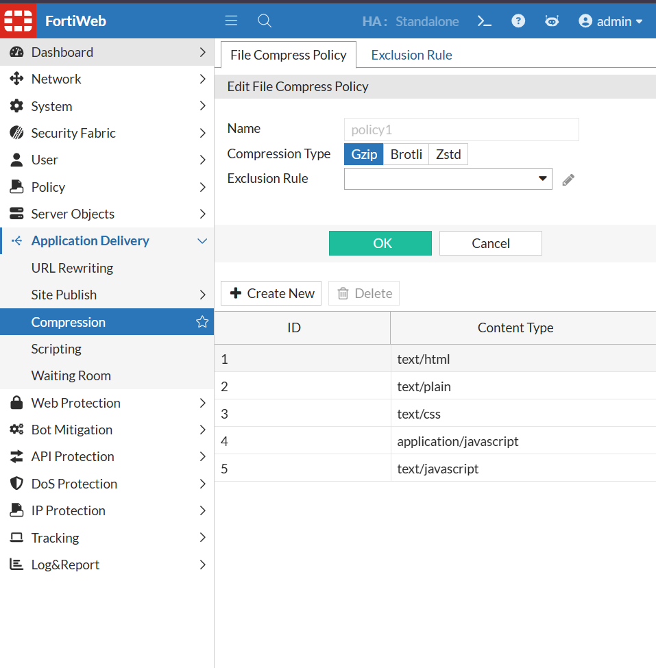

```bash
# Uncompressed baseline
curl -sS -H 'Accept-Encoding: identity' \
  -D /tmp/l6_plain.headers -o /tmp/l6_plain.body \
  http://delivery.lab.local/static/large.txt

# Raw gzip response
curl -sS -H 'Accept-Encoding: gzip' \
  -D /tmp/l6_gzip.headers -o /tmp/l6_gzip.raw \
  http://delivery.lab.local/static/large.txt

grep -iE 'content-type|content-length|content-encoding|vary' \
  /tmp/l6_gzip.headers
wc -c /tmp/l6_plain.body /tmp/l6_gzip.raw

# Transparent client decompression
curl --compressed http://delivery.lab.local/static/large.txt | head
```

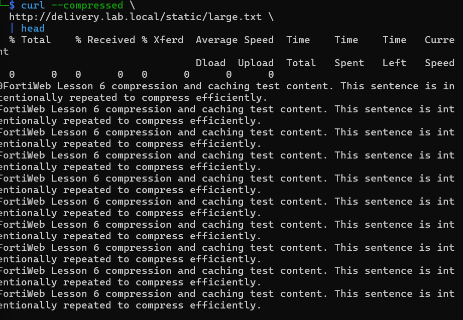

Expected `curl: (23)` after piping the large response to `head` is not a FortiWeb error; `head` closes the pipe after ten lines while curl still has output to write.

## 10. Web caching

Caching stores eligible public static responses at FortiWeb. The first matching request reaches the Python backend and populates the cache; later identical requests can be answered before they consume backend capacity.

| Setting | Intended final value |
| --- | --- |
| Feature | Web Cache enabled in Feature Visibility and `Test1_pol` |
| Host / path | `delivery.lab.local` / `/static/` |
| Methods / status | GET, HEAD / `200` |
| Cache key | Method, protocol, host, URL, arguments; cookies excluded |
| Inactive expiry | 60 minutes |
| Excluded by scope | `/private/`, `/sale`, `/counter`, APIs, and other dynamic paths |

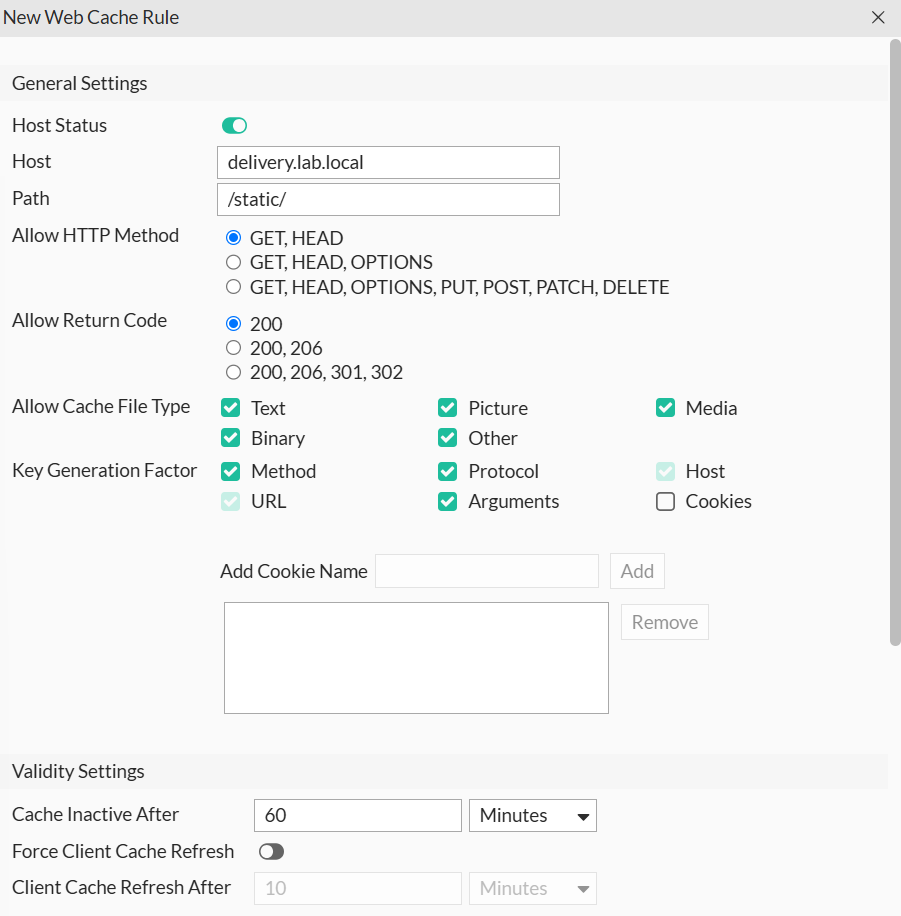

Evidence reconciliation: the supplied GUI capture shows all cache file-type boxes selected, while the report records the intended final scope as `Text`. For the tightest reproducible configuration, select only `Text`; the validation object is `/static/large.txt`.

The pre-cache baseline shows repeated identical requests reaching the backend:

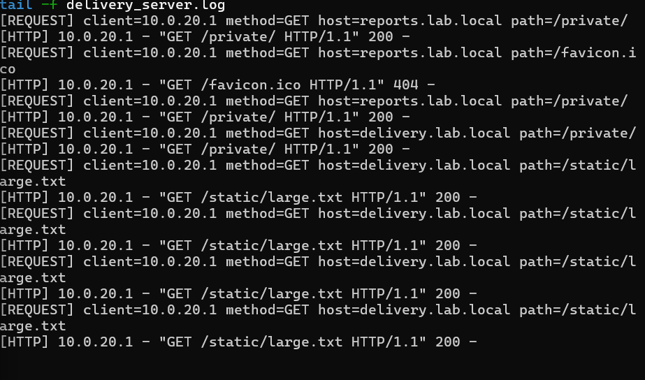

Post-enable validation:

```bash
# Backend terminal
tail -f ~/lesson6-delivery/delivery_server.log

# Kali terminal
for i in {1..3}; do
  curl -s -H 'Accept-Encoding: identity' -o /dev/null \
    http://delivery.lab.local/static/large.txt
done
```

Successful result: only the first post-expiry matching request creates a new `/static/large.txt` backend log entry. The later identical requests are served by FortiWeb.

## 11. Acceleration

Acceleration optimizes eligible resources in transit without changing the backend files.

| Option | Final value |
| --- | --- |
| Policy | `acc_1` |
| HTML minification | Enabled |
| Combine Heads | Enabled |
| Move CSS to Head | Enabled |
| JavaScript minification | Enabled |
| CSS minification | Enabled |
| Image minification | Enabled |
| Exceptions | None for the controlled Lesson 6 target |
| Attachment | Directly selected in `Test1_pol` |

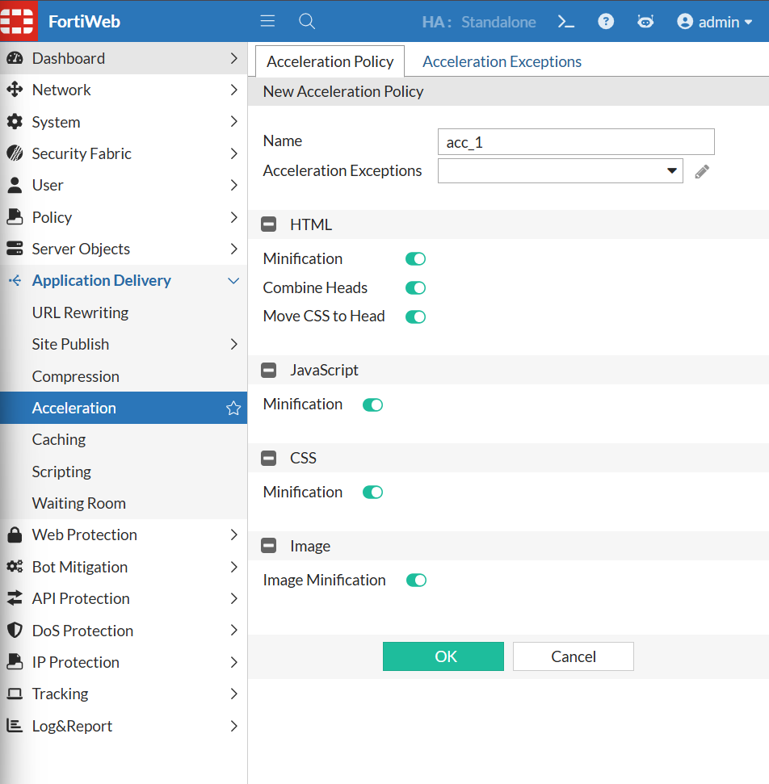

```bash
curl -s http://127.0.0.1:8003/ -o /tmp/l6_backend_original.html
curl -s -H 'Accept-Encoding: identity' \
  http://delivery.lab.local/ -o /tmp/l6_accelerated.html

wc -c /tmp/l6_backend_original.html /tmp/l6_accelerated.html
diff -u /tmp/l6_backend_original.html /tmp/l6_accelerated.html
```

The meaningful check is not only a size difference: the browser must still load the page, CSS, and JavaScript correctly after optimization.

## 12. Lua scripting

The script marks only `delivery.lab.local` requests, then adds a response header to the same transaction. Other shared-VIP applications should not inherit the marker.

Source: [`configs/lua_header_l6.lua`](configs/lua_header_l6.lua)

```lua
when HTTP_REQUEST {
    local host = HTTP:host()

    if host == "delivery.lab.local" then
        HTTP:setpriv("delivery_l6")
    end
}

when HTTP_RESPONSE {
    if HTTP:priv() == "delivery_l6" then
        HTTP:add_header("X-Lesson6-Lua", "active")
    end
}
```

| Setting | Value |
| --- | --- |
| Script | `lua_header_l6` |
| Attachment | Scripting enabled directly in `Test1_pol`; script added to its list |
| Positive host | `delivery.lab.local` |
| Negative control | Another shared-VIP hostname should not receive the header |

```bash
curl -I http://delivery.lab.local/
curl -I http://api.lab.local/health
```

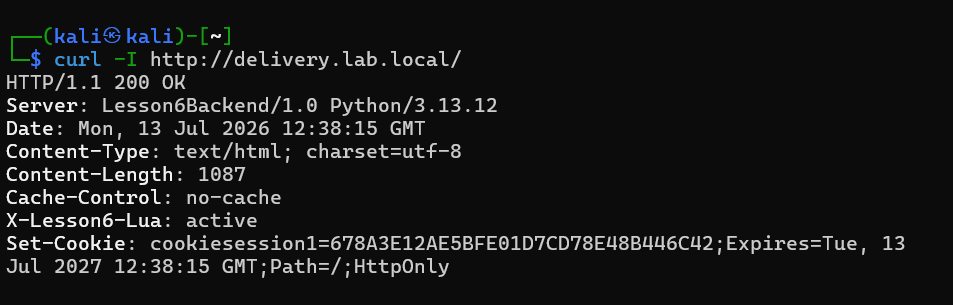

Successful result: the first response contains `X-Lesson6-Lua: active`; the unrelated application does not.

## 13. Waiting Room

Waiting Room controls admission to a high-demand path before excess visitors consume backend workers. `/sale` deliberately sleeps for eight seconds so the behavior can be observed.

| Setting | Value |
| --- | --- |
| Policy | `waiting_room_l6` |
| Path / type | `/sale` / Simple String |
| Total active users | 1 |
| New users per minute | 1 |
| Session duration | 1 minute |
| Queue page | Default FortiWeb Waiting Room page |
| Bypass rules | None |
| Attachment | Waiting Room selected through `clone_inline` |

Validation requires independent browser sessions because one browser and its incognito window must not share the same FortiWeb queue/session cookie.

1. Measure the baseline `/sale` response; it should take about eight seconds.
2. Enable and attach `waiting_room_l6`.
3. Open `/sale` in the first browser session.
4. Immediately open `/sale` from an independent second session.
5. Confirm the first visitor reaches the application and the second receives the FortiWeb queue page.
6. Confirm `/` and `/new` remain normally accessible.

This is a controlled capacity test, not a denial-of-service attack. It proves that FortiWeb can absorb excess arrivals before the backend performs the expensive work.

## 14. Final attachment chain

```text
Test1_pol
  +-- HTTP Content Routing
  |     +-- route_delivery_l6 -> pool_delivery_l6 -> 10.0.20.2:8003
  |     +-- route_reports_l6  -> pool_delivery_l6 -> 10.0.20.2:8003
  |
  +-- Web Protection Profile: clone_inline
  |     +-- URL Rewriting Policy: urlrewrite_policy_l6
  |     +-- Compression Policy: compress_l6 / captured policy1
  |     +-- Waiting Room Policy: waiting_room_l6
  |
  +-- Site Publish Policy
  |     +-- first_site_pub
  |     +-- reports_site_pub
  |
  +-- Web Cache: host/path-scoped rule
  +-- Acceleration Policy: acc_1
  +-- Scripting: lua_header_l6
```

## 15. Validation matrix

| Control | Test | Successful result | Evidence type |
| --- | --- | --- | --- |
| Backend health | `curl http://127.0.0.1:8003/` | `200 OK` | curl/backend |
| FortiWeb route | `curl http://delivery.lab.local/` | `200`; FortiWeb transaction cookie | curl |
| Redirect | `curl -iL .../old` | `302` to `/new`, then `200` | Screenshot + curl |
| Internal rewrite | Request `/legacy/page`; inspect backend log | Modern page; log path `/modern/page` | curl + backend log |
| Location rewrite | `curl -i .../backend-redirect` | Public hostname; no private IP | Screenshot + curl |
| Site Publishing | Browser `/private/` | FortiWeb login before backend | Screenshot + browser |
| Valid/invalid LDAP | Correct and wrong password | Correct opens; wrong denied | Browser + LDAP bind |
| SSO | Login to delivery, open reports | No second login | Two-host browser flow |
| Compression | Request gzip and use `--compressed` | gzip header; readable body | Screenshot + headers |
| Caching | Three identical `/static/` requests | Only first reaches backend | Backend log |
| Acceleration | Compare direct and FortiWeb output | Optimized output; page stays functional | Config + diff/browser |
| Lua | `curl -I delivery.lab.local` | `X-Lesson6-Lua: active` | Screenshot + header |
| Waiting Room | Two independent `/sale` sessions | First admitted; second queued | Manual browser flow |
| Public regression | `/`, `/new`, earlier hosts | Unauthenticated public content still works | Smoke tests |

Run the automated subset with [`../../scripts/validation/lesson-06.sh`](../../scripts/validation/lesson-06.sh), then complete the authentication, SSO, cache-log, and Waiting Room browser checks manually.

## 16. Troubleshooting

| Symptom | Likely cause | Corrective action |
| --- | --- | --- |
| Both Lesson 6 hosts fail | Backend process stopped or pool member down | Start `delivery_server.py`; check `:8003`, health check, and pool status |
| Rewrite object exists but traffic is unchanged | Parent policy/profile not attached | Verify rule -> `urlrewrite_policy_l6` -> `clone_inline` -> `Test1_pol` |
| Another application is rewritten | Missing Host condition or broad URL regex | Anchor the exact host and path with `^...$` |
| Private path remains public | Site Publish policy/rule is not attached or path differs | Check host, `/private/`, auth pool, and `Test1_pol` |
| LDAP login fails | Bind DN, search base, identifier, password, or reachability mismatch | Prove `ldapwhoami` first; then test `ldap_l6` from FortiWeb |
| SSO prompts twice | Rules differ, SSO disabled, domain mismatch, or stale cookies | Use `.lab.local` on both rules and retest in a fresh session |
| Compression is absent | Client did not advertise gzip or content type is ineligible | Send `Accept-Encoding: gzip`; inspect `Content-Encoding` |
| Every static request reaches backend | Web Cache disabled, cache key differs, or rule scope/type is wrong | Check Feature Visibility, `Test1_pol`, host/path, `Text`, and identical requests |
| Acceleration menu is absent | Feature Visibility is disabled | Enable Acceleration under System configuration |
| Lua header is absent | Script is not attached or the Host comparison misses | Check `Test1_pol` scripting list and exact Host value |
| Waiting Room never queues | Shared cookies, high limits, missing attachment, or path mismatch | Use independent sessions; set `/sale`, active users `1`, and confirm attachment |

## 17. Operational restart and rollback

```bash
# Restart after backend reboot
cd ~/lesson6-delivery
nohup python3 delivery_server.py > delivery_server.log 2>&1 &
echo $! > delivery_server.pid

sudo ss -lntp | grep ':8003'
curl -i http://127.0.0.1:8003/
docker ps --filter name=ldap-l6
sudo ss -lntp | grep ':389'
```

Rollback should remove or disable only Lesson 6 routes and objects. Do not delete the shared VIP, `Vip1`, `Test1_pol`, or `clone_inline`, because earlier lessons depend on them.

## 18. Evidence index

| File | What it proves | Limitation |
| --- | --- | --- |
| [`06-redirect-rule-config.png`](evidence/06-redirect-rule-config.png) | Exact host/path redirect rule | Configuration, not runtime result |
| [`06-redirect-before-after.png`](evidence/06-redirect-before-after.png) | Baseline `200`, then FortiWeb `302` and destination `200` | Contains an isolated lab transaction cookie |
| [`06-location-header-rewrite-config.png`](evidence/06-location-header-rewrite-config.png) | Public replacement `Location` | Configuration screenshot |
| [`06-site-publish-login.png`](evidence/06-site-publish-login.png) | FortiWeb intercepted `/private/` | Does not alone prove successful LDAP login |
| [`06-compression-policy.png`](evidence/06-compression-policy.png) | Gzip and content types | Captured name is `policy1` |
| [`06-compression-validation.png`](evidence/06-compression-validation.png) | Transparent decompression | Terminal excerpt does not show byte comparison |
| [`06-cache-baseline-backend-hits.png`](evidence/06-cache-baseline-backend-hits.png) | Repeated backend hits before effective cache | Baseline, not post-cache proof |
| [`06-cache-rule-config.png`](evidence/06-cache-rule-config.png) | Host/path/key/expiry rule | Capture shows broader file types than intended `Text` scope |
| [`06-acceleration-policy.png`](evidence/06-acceleration-policy.png) | Optimization toggles in `acc_1` | Runtime diff remains command-based evidence |
| [`06-lua-response-header.png`](evidence/06-lua-response-header.png) | Injected `X-Lesson6-Lua` header | Contains an isolated lab transaction cookie |

Screenshots are supporting evidence. The reproducible commands, backend logs, and positive/negative controls remain the primary proof.

## 19. Final status

Lesson 6 completed an integrated application-delivery layer on top of the Lessons 1-4 reverse-proxy and security architecture. FortiWeb changed routes, headers, identity flow, response size, cache behavior, resource delivery, and user admission without adding authentication or delivery logic to the application itself.
