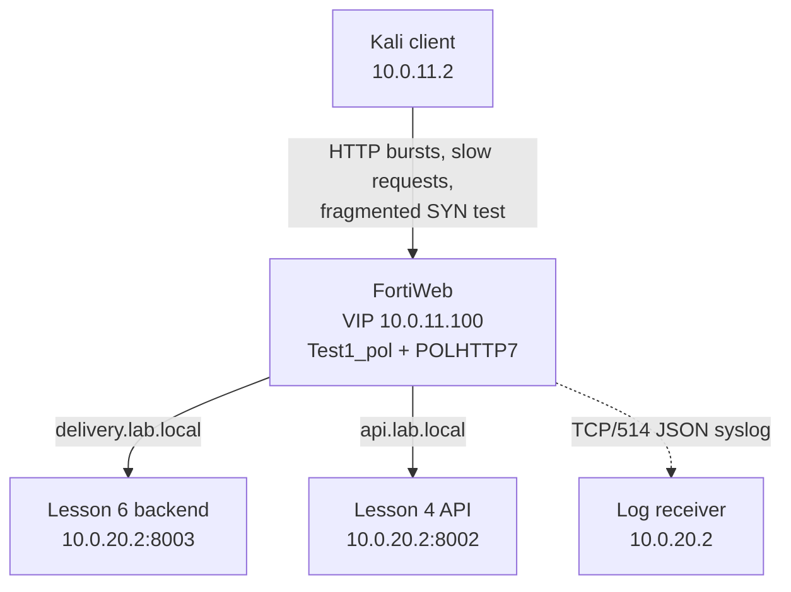

# Lesson 07 - DoS Protection and Logging

> Lab status: Complete
>
> Documentation status: Complete
>
> Completed: 2026-07-13
>
> Depends on: [Lesson 06](../06-application-delivery/README.md) and the [Lesson 04 API](../04-api-protection/README.md)

## 1. Scope

Lesson 7 extended the existing single-VIP lab with layered denial-of-service controls, packet-fragment protection, local logging, remote syslog forwarding, and sensitive-data masking.

No new protected application or VIP was created. The lesson deliberately reused deterministic endpoints from Lessons 4 and 6:

| Existing service | Endpoint | Lesson 7 purpose |
| --- | --- | --- |
| `delivery.lab.local` -> `10.0.20.2:8003` | `GET /new` | Fast requests-per-second tests |
| `delivery.lab.local` -> `10.0.20.2:8003` | `GET /slow` | Three-second connection-concurrency tests |
| `delivery.lab.local` -> `10.0.20.2:8003` | `GET /headers` | Fresh-session and recovery checks |
| `api.lab.local` -> `10.0.20.2:8002` | `POST /api/login` | Controlled JSON values for log-masking tests |
| Backend host infrastructure | `10.0.20.2:514/TCP` | JSON syslog receiver |

All HTTP tests continued through `10.0.11.100`, `Vip1`, and `Test1_pol`.

## 2. Integrated architecture



The lesson added protection and observability around the existing application path. It did not move DoS logic into the backends.

## 3. Evidence standard used in this write-up

The supplied report and standalone screenshots do not prove every result at the same depth. The report also contains one additional embedded Syslog Policy screenshot, which is preserved in this lesson's evidence folder. This README distinguishes the evidence explicitly:

- **Screenshot-verified:** visible in one of the supplied Lesson 7 captures.
- **Report-recorded:** the final report records the configuration or observed result, but no separate raw screenshot or output was supplied.
- **Operator-confirmed final state:** the policy screenshot was taken before the final Layer 3 change; the lab operator confirmed that Fragment Protection was enabled afterward.

This distinction avoids treating a configuration screen as runtime proof or an intermediate capture as the final state.

## 4. Final FortiWeb objects

| Object type | Final report name | Critical value | Role |
| --- | --- | --- | --- |
| HTTP Flood Prevention | `FP_1` | 3 requests/sec; Bot Confirmation off; High; Alert baseline; 30-second Period Block test | Per-session, per-URL request-rate control |
| HTTP Access Limit | `HAL_7` | Standalone IP 5 req/sec; shared IP 10 req/sec; Bot Confirmation off; High | Per-source-IP aggregate request-rate control |
| Malicious IPs | `MALIP_7` | 5 TCP connections per HTTP session; High; Alert baseline and enforcement test | Per-session connection-concurrency control |
| TCP Flood Prevention | `TCPFP_7` | 5 fully formed TCP connections per source IP; High | Per-source-IP connection-concurrency control |
| DoS Protection Policy | `POLHTTP7` | Session-based prevention, HTTP DoS prevention, and Layer 3 Fragment Protection | Combined policy attached to `Test1_pol` |
| Syslog Policy | `syslogssss` | `10.0.20.2:514`, TCP, JSON | Remote Event, Attack, and Traffic logs |
| Sensitive-data rule | `sensitive_l7` | General-mask expressions for password, token, and card-like JSON values | Masks matching values in new packet-payload logs |

### Captured-name note

The supplied policy screenshot is an intermediate capture. It shows `accLim1` and `MalIP` selected and Layer 3 Fragment Protection off. The final report records the completed names as `HAL_7` and `MALIP_7`; the lab operator confirmed that Fragment Protection was enabled after this capture. The screenshot is retained as pre-final composition evidence, not presented as the final policy state.

## 5. Final attachment chain

```text
Test1_pol
  +-- POLHTTP7
       +-- HTTP Session Based Prevention
       |    +-- FP_1       (HTTP Flood Prevention)
       |    +-- MALIP_7    (Malicious IPs)
       +-- HTTP DoS Prevention
       |    +-- HAL_7      (HTTP Access Limit)
       |    +-- TCPFP_7    (TCP Flood Prevention)
       +-- Layer 3 Fragment Protection
  +-- Local disk logging: Event + Attack + Traffic
  +-- Remote syslog: syslogssss -> 10.0.20.2:514/TCP, JSON
  +-- Sensitive Data Logging: sensitive_l7
```

Creating the child rules alone is not sufficient. `FP_1`, `MALIP_7`, `HAL_7`, and `TCPFP_7` must be selected by `POLHTTP7`, and `POLHTTP7` must be the active DoS policy on `Test1_pol`.

### Lesson 4 carry-forward check

Lesson 4 previously documented `dos_policy_lesson4` for `/api/login`. The Lesson 7 report records `POLHTTP7` as the final combined DoS policy but does not show whether the earlier login rule was migrated into it. If the appliance build exposes only one DoS-policy selector on `Test1_pol`, re-test the Lesson 4 login limit and add that rule to the combined policy if required. This repository does not claim simultaneous attachment without evidence.

## 6. Why the four controls are different

| Protection | Counted resource | Client identity | URL-specific | Best lab target |
| --- | --- | --- | --- | --- |
| `FP_1` | HTTP requests/sec | FortiWeb HTTP session/cookie | Yes | Fast `/new` with one cookie |
| `HAL_7` | HTTP requests/sec | Source IP | No; aggregate | `/new?request=N`, then `/headers` |
| `MALIP_7` | Concurrent TCP connections | FortiWeb HTTP session/cookie | No | Slow `/slow` with one or two cookies |
| `TCPFP_7` | Fully formed concurrent TCP connections | Source IP | No | Parallel `/slow` requests |
| Layer 3 Fragment Protection | Fragmented/malformed IP traffic | Packet structure | Not applicable | Small fragmented SYN sequence to VIP port 80 |

Request-rate controls do not replace connection-count controls. Session-aware rules can distinguish logical clients behind one NAT address; source-IP rules intentionally combine them.

The thresholds are deliberately low for an isolated EVE-NG lab. They are not production recommendations.

## 7. HTTP Flood Prevention - `FP_1`

`FP_1` limits requests per second from one FortiWeb HTTP session to one URL. The test held both the session cookie and `/new` constant.

```bash
rm -f /tmp/l7.cookies
curl -s -c /tmp/l7.cookies http://delivery.lab.local/new -o /dev/null

seq 1 12 | xargs -I{} -P12 sh -c '
  curl -s -b /tmp/l7.cookies -o /dev/null \
    -w "request={} code=%{http_code} time=%{time_total}s\n" \
    http://delivery.lab.local/new
'
```

| Phase | Action | Report-recorded result |
| --- | --- | --- |
| Detection | Alert | Requests continued with `200`; HTTP Flood Prevention attack log appeared |
| Enforcement | Period Block, 30 seconds | The same session was denied after exceeding the threshold |
| Recovery | Wait about 30 seconds | `/new` succeeded again without manual state removal |

The supplied attack-log capture independently shows the HTTP Flood Prevention subtype for source `10.0.11.2`, host `delivery.lab.local`, and URL `/new`.

## 8. HTTP Access Limit - `HAL_7`

`HAL_7` counts aggregate HTTP requests per source IP. Separate standalone and shared-IP thresholds account for NAT or proxy concentration.

```bash
seq 1 12 | xargs -I{} -P12 sh -c '
  curl -s -o /dev/null \
    -w "request={} code=%{http_code} time=%{time_total}s\n" \
    "http://delivery.lab.local/new?request={}"
'

rm -f /tmp/l7-fresh.cookies
curl -i -c /tmp/l7-fresh.cookies http://delivery.lab.local/headers
```

The varied query values generated broad source activity rather than relying on one identical session/URL pattern. The report records that a fresh cookie remained blocked during the 30-second source-IP period block and that `/headers` recovered after expiration.

The supplied attack-log capture independently shows the HTTP Access Limit subtype for the same source, policy, host, and URL.

## 9. Malicious IPs - `MALIP_7`

In this FortiWeb feature, “Malicious IPs” is a session-aware TCP connection limit, not an IP-reputation list. `/slow` waits approximately three seconds so connections overlap.

### One session over the limit

```bash
rm -f /tmp/malip7.cookies
curl -s -c /tmp/malip7.cookies http://delivery.lab.local/new -o /dev/null

seq 1 8 | xargs -I{} -P8 sh -c '
  curl --http1.1 -H "Connection: close" \
    -b /tmp/malip7.cookies -s -o /dev/null \
    -w "request={} code=%{http_code} time=%{time_total}s\n" \
    http://delivery.lab.local/slow
'
```

### Two logical clients behind the same IP

```bash
curl -s -c /tmp/clientA.cookies http://delivery.lab.local/new -o /dev/null
curl -s -c /tmp/clientB.cookies http://delivery.lab.local/new -o /dev/null

# Run four concurrent /slow requests with each cookie jar.
# Both sessions originate from 10.0.11.2 but individually remain below five.
```

The report records that eight requests sharing one cookie crossed the limit, while two four-request sessions were treated independently. The attack-log screenshot independently shows the Malicious IPs subtype for the burst against `/new`; it does not show the separate two-cookie comparison.

## 10. TCP Flood Prevention - `TCPFP_7`

`TCPFP_7` limits fully formed TCP connections per source IP. Unlike `MALIP_7`, all sessions behind the same IP contribute to one count.

```bash
seq 1 6 | xargs -I{} -P6 sh -c '
  curl -s -o /dev/null \
    -w "request={} code=%{http_code} total=%{time_total}s\n" \
    http://delivery.lab.local/slow
'
```

The report records a five-connection threshold and a controlled six-request `/slow` exercise. No separate TCP Flood Prevention log screenshot was supplied; validate the final state by filtering local Attack logs for that subtype.

## 11. Layer 3 Fragment Protection

Fragment Protection operates before a complete HTTP transaction exists. It evaluates fragmented or malformed IP traffic without depending on hostname, URL, or cookie state.

```bash
sudo hping3 -S -p 80 -d 120 -f -c 10 10.0.11.100
curl -i http://delivery.lab.local/new
```

Only ten packets were sent. The report records a fragment-protection event and a successful post-test HTTP request. The supplied policy image predates the final enablement; the lab operator confirmed that the toggle was enabled afterward.

## 12. Local and remote logging

### Local disk

Global Log Settings retained Event, Attack, and Traffic logs at Information level and overwrote the oldest logs when the disk filled.

| Log category | Lesson 7 use |
| --- | --- |
| Traffic | Normal request flow, host, URL, method, response, and policy context |
| Attack | DoS subtype, source `10.0.11.2`, severity, action, and protected route |
| Event | Saved configuration and administrative/system changes |

The supplied Global Log Settings screenshot verifies that Disk logging was enabled at Information level for all three categories.

### Remote syslog

| Setting | Final report value |
| --- | --- |
| Policy | `syslogssss` |
| Destination | `10.0.20.2` |
| Port / transport | `514/TCP` |
| Format | JSON |
| Categories | Event, Attack, Traffic |
| Facility | Local use 7 |
| Level | Information |

The Global Log Settings screenshot verifies selection of `syslogssss`, Information level, local use 7, and all three categories. The Syslog Policy screenshot embedded in the report directly verifies `10.0.20.2`, port `514`, TCP, and JSON. Receiver-side message delivery remains report-recorded because no captured JSON record was supplied.

## 13. Sensitive-data logging

Sensitive Data Logging masks matching values in new packet-payload logs. It protects log output; it does not change the application transaction and does not replace schema validation, DLP, TLS, authentication, or authorization.

The report records these General Mask expressions:

```regex
"password"\s*:\s*"[^"]*"
"token"\s*:\s*"[^"]*"
"card"\s*:\s*"[^"]*"
```

They are also stored in [`configs/sensitive-data-masks.txt`](configs/sensitive-data-masks.txt).

```bash
curl -i -X POST http://api.lab.local/api/login \
  -H 'Content-Type: application/json' \
  --data '{"username":"kady","password":"Lesson7Secret!","token":"lesson7-fake-token","card":"4111111111111111"}'
```

The existing Lesson 4 OpenAPI/JSON controls may reject the extra fields. That does not invalidate a log-masking test: inspect the newly generated packet log and confirm the configured substrings are obscured while source, host, URL, method, policy, subtype, and action remain useful. No sensitive-payload screenshot was supplied; the masking result is report-recorded.

## 14. Validation matrix

| Stimulus | Control isolated | Pass condition | Supplied evidence |
| --- | --- | --- | --- |
| 12 same-cookie `GET /new` requests | `FP_1` session + URL rate | Detection; same-session period block; timed recovery | Attack subtype screenshot plus report |
| 12 source-IP requests with varied query values | `HAL_7` source-IP rate | Fresh cookie cannot bypass; timed recovery | Attack subtype screenshot plus report |
| 8 same-cookie `GET /slow` requests | `MALIP_7` session connections | Session crosses five; excess detected/denied | Report; combined screenshot shows subtype on `/new` |
| Two cookies, four `/slow` each | `MALIP_7` session separation | Both logical clients remain under five | Report only |
| 6 parallel `GET /slow` requests | `TCPFP_7` source-IP connections | TCP Flood Prevention event above five | Report only |
| 10 fragmented SYN packets | Layer 3 Fragment Protection | Fragment event; normal HTTP still works | Report + operator-confirmed final enablement |
| Controlled JSON login body | `sensitive_l7` | Values obscured; useful log context retained | Report only |
| Normal + DoS events | `syslogssss` | JSON Event/Attack/Traffic records arrive on TCP/514 | Global settings + Syslog Policy screenshots; receiver result from report |

## 15. Troubleshooting and operational notes

| Symptom | Likely cause | Corrective action |
| --- | --- | --- |
| Several subtypes fire on one burst | Multiple low-threshold rules are active | Isolate enforcement one rule at a time; keep the others in Alert |
| Fast requests do not cross a connection limit | Connections close before they overlap | Use `/slow` for `MALIP_7` and `TCPFP_7` |
| Session-aware results are inconsistent | Cookie jars were not intentionally reused or separated | Create one cookie for same-session tests and two jars for NAT-awareness tests |
| A new cookie is still blocked | `HAL_7` keys on source IP | Wait for the source-IP period block to expire |
| Fragment test has no log | Layer 3 protection was not enabled in the final saved policy, packet fragmentation failed, or wrong VIP/port was targeted | Confirm final `POLHTTP7`, use the controlled `hping3` command, and filter Attack logs |
| Masked values remain visible | Historical log inspected or rule not selected | Enable `sensitive_l7`, generate a new request, and inspect only the new payload log |
| No remote messages | Receiver and FortiWeb port/transport mismatch | Match `514/TCP`, permit the FortiWeb source, then generate fresh Event/Attack/Traffic entries |
| Lesson 4 login rate no longer triggers | `POLHTTP7` replaced the earlier DoS policy | Migrate the login rule into the active combined policy and re-test |

Outside deliberate enforcement tests, the report returned the low lab thresholds to Alert to avoid disrupting normal browsing through the shared VIP.

## 16. Automated and manual validation

Run the safe focused checks:

```bash
./scripts/validation/lesson-07.sh
```

Run one controlled attack pattern at a time:

```bash
./scripts/attacks/lesson-07.sh fp
./scripts/attacks/lesson-07.sh hal
./scripts/attacks/lesson-07.sh malip
./scripts/attacks/lesson-07.sh malip-nat
./scripts/attacks/lesson-07.sh tcp
./scripts/attacks/lesson-07.sh sensitive

# Explicit opt-in is required for packet generation.
ENABLE_FRAGMENT_TEST=1 ./scripts/attacks/lesson-07.sh fragment
```

FortiWeb log review, action changes, block timers, session identity, syslog receiver output, and value masking remain manual appliance-side checks.

## 17. Regression set

```bash
curl -I http://juice.lab.local
curl -I http://webgoat.lab.local/WebGoat/
curl -I http://urlenc.lab.local/public/lwjs.html
curl -i http://api.lab.local/health
curl -i http://delivery.lab.local/new
curl -i http://reports.lab.local/
```

After each blocking test, confirm that the temporary block has expired or return the tested rule to Alert before judging unrelated application availability.

## 18. Evidence index

| File | What it proves | Limitation |
| --- | --- | --- |
| [`07-dos-policy-intermediate.png`](evidence/07-dos-policy-intermediate.png) | `POLHTTP7` selected session-aware and HTTP DoS children in the captured configuration | Pre-final capture: shows `accLim1`, `MalIP`, and Fragment Protection off; final report and operator confirmation supersede this state |
| [`07-dos-attack-log.png`](evidence/07-dos-attack-log.png) | `Test1_pol` logged Malicious IPs, HTTP Access Limit, and HTTP Flood Prevention for `10.0.11.2`, `delivery.lab.local`, `/new` | Does not prove TCPFP_7, fragment protection, block duration, recovery, or two-cookie separation |
| [`07-global-log-settings.png`](evidence/07-global-log-settings.png) | Disk and syslog enabled at Information level; Event, Attack, and Traffic selected; policy `syslogssss`; local use 7 | Does not show the syslog destination page or receiver-side JSON records |
| [`07-syslog-policy.png`](evidence/07-syslog-policy.png) | Embedded report figure showing `syslogssss` -> `10.0.20.2:514/TCP` in JSON format | Configuration evidence; does not show a received JSON record |

## 19. Rebuild and rollback

Rebuild order:

1. Verify Lessons 4 and 6 routes and the single VIP.
2. Create `FP_1`, `HAL_7`, `MALIP_7`, and `TCPFP_7` in Alert mode.
3. Create `POLHTTP7`, select all four children, and enable Layer 3 Fragment Protection.
4. Attach `POLHTTP7` to `Test1_pol` and preserve or migrate any required earlier DoS rules.
5. Run one isolated detection/enforcement/recovery sequence per control.
6. Enable local Event, Attack, and Traffic logging at Information level.
7. Configure `syslogssss` for `10.0.20.2:514/TCP`, JSON, and verify receiver output.
8. Create `sensitive_l7`, generate a new controlled payload, and inspect the new log.
9. Return low lab thresholds to Alert and run the full regression set.

Rollback should detach or disable Lesson 7 objects only. Do not delete `10.0.11.100`, `Vip1`, `Test1_pol`, `clone_inline`, the Lesson 4 API route, or the Lesson 6 delivery routes.

## 20. Final status

Lesson 7 completed a layered DoS and logging extension of the existing integrated lab. The repository records which outcomes are directly screenshot-verified, which are preserved from the final report, and why the supplied policy image is an intermediate rather than final Fragment Protection state.
