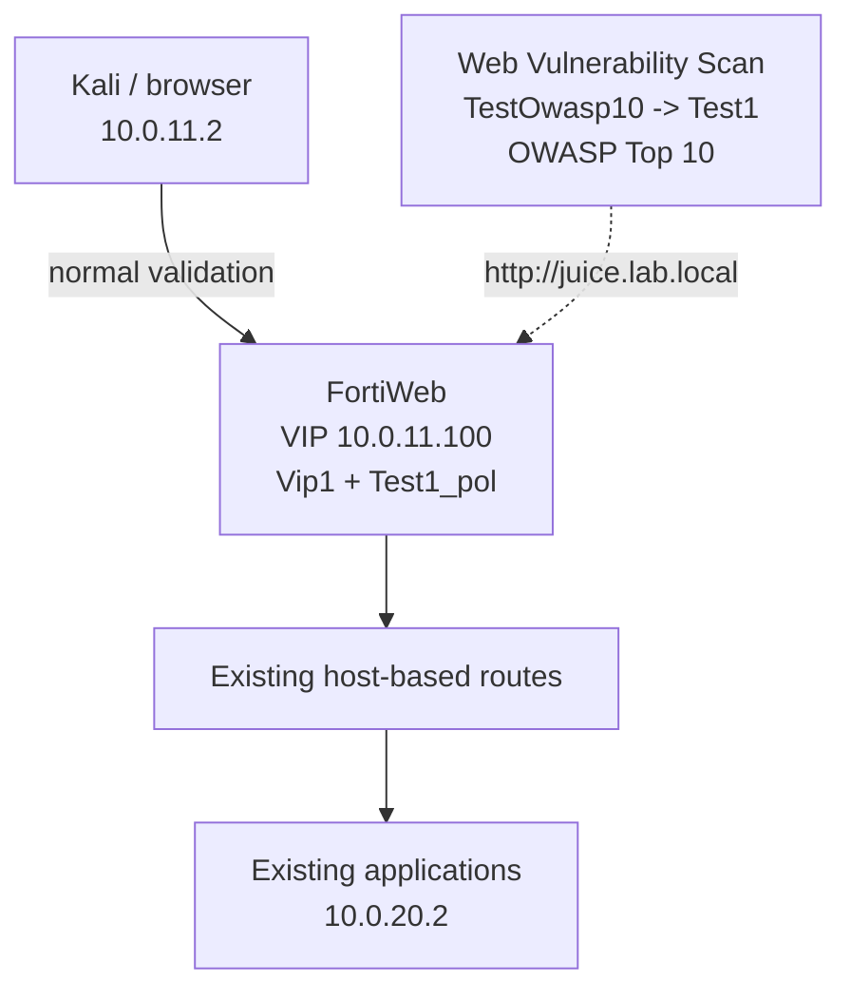

# Lesson 08 - Compliance and Vulnerability Scanning

> Lab status: Complete
>
> Documentation status: Complete
>
> Completed: 2026-07-14
>
> Depends on: the single-VIP lab through [Lesson 07](../07-dos-and-logging/README.md), with direct API-security correlation to [Lesson 04](../04-api-protection/README.md)

## 1. Scope

Lesson 8 added compliance interpretation and vulnerability-assessment capability to the cumulative FortiWeb lab. Most topics were knowledge and operational workflow: PCI DSS 4.0.1, OWASP Top 10 - 2021, OWASP API Security Top 10 - 2023, compliance dashboards, scanner recommendations, FortiDAST integration, Security Fabric, and evidence retention.

The only hands-on addition was FortiWeb **Web Vulnerability Scan**. It was enabled and used against the existing Juice Shop publication at `http://juice.lab.local`. The lesson did not create or change a backend application, server pool, protected hostname, content route, VIP, virtual server, manual attack, or enforcement protection.

| Scope item | Lesson 8 result |
| --- | --- |
| Existing entry point | `10.0.11.100` -> `Vip1` -> `Test1_pol` |
| Existing routing model | HTTP Host-based content routing |
| Hands-on addition | Web Vulnerability Scan feature and profile/template workflow |
| Scan profile | `Test1` |
| Scan target | `http://juice.lab.local` |
| Selected template | `OWASP Top 10` |
| Scan policy / execution | `TestOwasp10`; `Run Now`; captured status `Starting` |
| New backend, pool, or route | None |
| Manual attack or exploit chain | None |
| New runtime protection | None |
| FortiDAST deployment | Not deployed; integration workflow covered as knowledge |

## 2. Architecture delta

The data plane did not change. Lesson 8 added an assessment workflow around the published applications rather than another protected service.



The inherited traffic chain remained:

```text
authorized client or scanner
  -> existing hostname resolves to 10.0.11.100
  -> Vip1
  -> Test1_pol
  -> existing content route
  -> existing server pool and application
```

Web Vulnerability Scan is an assessment capability. It is not another child enforcement control under `clone_inline` or `POLHTTP7`.

## 3. Evidence standard and captured proof

The supplied Lesson 8 report embeds eight course screenshots. Four additional appliance screenshots now provide direct lab proof for feature visibility, the built-in template list, profile configuration, and scan launch.

This write-up uses three evidence labels:

- **Course screenshot:** proves what the course presented or which workflow/menu exists.
- **Lab screenshot:** directly proves the captured FortiWeb configuration or runtime state.
- **Report-recorded:** the completed report states that the operator performed it, but the exact runtime screen/output was not preserved.

| Claim | Evidence status |
| --- | --- |
| Web Vulnerability Scan visibility enabled | Lab screenshots show the enabled toggle and the resulting scan menus |
| Available built-in templates | Lab screenshot shows `Full Audit`, `Fast Scan`, `Brute Force`, and `OWASP Top 10` |
| Exact scanned hostname, protocol, and path | Lab screenshot: `http://juice.lab.local` |
| Scan profile and selected template | Lab screenshot: `Test1` with `OWASP Top 10` |
| Scan policy and execution mode | Lab screenshot: `TestOwasp10`, `Run Now` |
| Runtime state at capture | Lab screenshot: `Starting` |
| New backend, manual attack, or runtime protection | Not applicable; none added |

There is no conflict between the report and screenshots. The new lab captures provide target-specific proof for the implemented scan workflow.

## 4. Prior-lesson correlation

| Prior lesson | Capability reused or interpreted in Lesson 8 |
| --- | --- |
| Lessons 1-2 | Stable reverse proxy, VIP, pools, protected hostnames, content routing, XFF, persistence, and HTTPS offload provide published scan targets |
| Lesson 3 | Signatures, CSRF, DLP, CORS, parameter/file controls, and web-shell detection illustrate runtime mitigations for discovered weaknesses |
| Lesson 4 | JSON, XML, GraphQL, OpenAPI, JWT, method control, and rate limiting provide practical context for the OWASP API Security Top 10 |
| Lesson 6 | Rewriting, authentication, SSO, compression, caching, acceleration, scripting, and Waiting Room show that assessment scope must include identity and delivery behavior |
| Lesson 7 | DoS controls, traffic/attack/event logs, syslog, and masking provide runtime evidence and can affect active-scan traffic |

Lesson 8 evaluates and governs the cumulative system; it does not replace any earlier control.

## 5. PCI DSS 4.0.1 knowledge

FortiWeb can contribute technical controls and audit evidence, but a WAF does not make an organization PCI DSS compliant by itself.

| Requirement theme | FortiWeb/lab contribution | Boundary |
| --- | --- | --- |
| Secure networks and systems | Reverse-proxy isolation, TLS, host/method constraints, controlled exposure | Network architecture and secure configuration remain broader responsibilities |
| Protect account data | HTTPS, response DLP, cookie/header controls, sensitive-log masking | Data discovery, retention, encryption, and key management extend beyond the WAF |
| Vulnerability management | Web Vulnerability Scan, signatures, virtual patching, file/API controls | Secure coding, dependency patching, and remediation ownership remain required |
| Access control | Site Publishing, LDAP, SSO, URL policies, API-supporting controls | Application authorization and identity governance remain essential |
| Monitoring and testing | Traffic/attack/event logs, scan history, reports, audit logs, retest records | Evidence must be retained and reviewed through an organizational process |
| Governance | Policy enforcement and technical evidence | Scoping, training, vendor management, incident response, and independent validation are organizational duties |

The course best-practice themes were cardholder-data security, firewalls/access controls, regular scans, encryption, vendor compliance, access restriction, incident response, regular testing, employee training, and data retention.

## 6. OWASP Top 10 - 2021 mapping

The mapping is many-to-many and describes risk reduction, not automatic elimination of a category.

| Category | FortiWeb/lab correlation | Application-side boundary |
| --- | --- | --- |
| A01 Broken Access Control | URL access, protected hostnames, Site Publishing, CORS/CSRF, API controls, tracking/logging | Object/function authorization must be enforced by the application |
| A02 Cryptographic Failures | HTTPS offload/redirect, HSTS/header and cookie security, DLP, masked logs | Correct data classification, storage encryption, and key management remain required |
| A03 Injection | Known/custom signatures, parameter and JSON/XML/GraphQL validation, file and web-shell controls | Parameterized queries, contextual encoding, and safe interpreter use belong in code |
| A04 Insecure Design | Threat-informed review, scanning, custom controls, explicit workflows | A WAF cannot redesign insecure business logic |
| A05 Security Misconfiguration | Host/method/protocol constraints, HTTPS, headers, Site Publishing, scanning | Systems and dependencies still require secure baselines and change control |
| A06 Vulnerable and Outdated Components | Known-exploit signatures, scanning, temporary virtual patching | Components must be inventoried and patched or upgraded |
| A07 Identification and Authentication Failures | LDAP Site Publishing, SSO, cookie controls, client management, JWT/API controls, rate limits | Identity/session design and recovery flows require application and IdP fixes |
| A08 Software and Data Integrity Failures | Schemas, OpenAPI, SRI, signatures, file security, scanning | Build/update provenance and supply-chain controls remain outside WAF scope |
| A09 Security Logging and Monitoring Failures | Traffic/attack/event logs, reports, FortiView, scan history, syslog | Alert ownership, retention, correlation, and response processes remain required |
| A10 Server-Side Request Forgery | Signatures, parameter/URL restrictions, file controls | Backend destination validation and egress allowlisting are primary controls |

## 7. OWASP API Security Top 10 - 2023 correlation

| API category | Existing lab context | Boundary |
| --- | --- | --- |
| API1 Broken Object Level Authorization | OpenAPI/path constraints and request validation | Backend must verify ownership for every object |
| API2 Broken Authentication | Lesson 4 login/JWT flow, rate limiting, HTTPS, identity controls | Secure credential, token, and session lifecycle remains required |
| API3 Broken Object Property Level Authorization | Strict JSON schemas and `additionalProperties: false` | Field-level read/write authorization belongs in the backend |
| API4 Unrestricted Resource Consumption | Request limits, GraphQL depth/batching, JSON/XML limits, DoS controls, Waiting Room | Capacity engineering and application-specific cost controls remain required |
| API5 Broken Function Level Authorization | Allowed methods and OpenAPI path/method enforcement | Backend roles must authorize privileged functions |
| API6 Unrestricted Access to Sensitive Business Flows | Rate limits, bot/client controls, CSRF, authentication | Workflow-specific abuse prevention requires business context |
| API7 Server-Side Request Forgery | Parameters, signatures, URL constraints | Backend destination validation and egress controls remain primary |
| API8 Security Misconfiguration | Protected hosts, methods, content types, schemas, HTTPS, CORS, headers | Secure deployment/configuration management remains required |
| API9 Improper Inventory Management | OpenAPI definitions, route inventory, API discovery/scan targets | Owners must maintain versions and retire obsolete endpoints |
| API10 Unsafe Consumption of APIs | Strict schemas/parsing, certificate validation, timeouts and limits | Application trust policy and upstream validation remain required |

Generic web crawling does not replace API contract, authorization, or business-flow testing.

## 8. Vulnerability-assessment model

No single technique gives complete coverage.

| Method | Strength | Limitation |
| --- | --- | --- |
| SAST/code review | Finds insecure patterns before deployment with source context | Requires source and cannot prove all runtime behavior |
| DAST/Web Vulnerability Scan | Tests externally exposed runtime behavior | Limited by crawlability, authentication, signatures, and business logic |
| API contract testing | Validates paths, methods, schemas, and responses | Does not prove object/function authorization |
| Manual penetration testing | Explores logic, authorization, and chained weaknesses | Time- and skill-dependent |
| Runtime WAF telemetry | Shows real traffic, signatures, actions, and client behavior | Sees only traffic that reaches the WAF |
| Dependency/configuration review | Finds outdated components and unsafe settings | Depends on accurate inventory and ownership |

An active scanner discovers and prioritizes; FortiWeb runtime controls inspect live traffic and can detect, challenge, rate-limit, or block. Neither replaces secure application remediation.

## 9. Web Vulnerability Scan implementation

### 9.1 Assessment chain

```text
System > Config > Feature Visibility
  -> enable Web Vulnerability Scan
  -> Scan Template: OWASP Top 10
  -> Scan Profile: Test1 -> http://juice.lab.local
  -> Web Vulnerability Scan Policy: TestOwasp10 -> Run Now
  -> Scan History
  -> compliance/reporting view and Recommendations
  -> validate, remediate, regression-test, and rescan
```

No new pool or route is required because the scan profile points to a target already reachable through the cumulative environment.

### 9.2 Components

| Component | Purpose | Lesson 8 record |
| --- | --- | --- |
| Feature Visibility | Exposes scan menus and functions | Enabled; directly screenshot-verified |
| Scan Template | Defines categories and techniques | `OWASP Top 10`; directly screenshot-verified |
| Scan Profile | Binds target and operational settings to a template | `Test1` -> `http://juice.lab.local`; directly screenshot-verified |
| Web Vulnerability Scan Policy | Binds execution mode to the profile | `TestOwasp10` -> `Run Now` -> `Test1`; directly screenshot-verified |
| Scan runtime state | Shows execution progress | `Starting` at capture |
| Scan History | Stores execution status and results | Menu visible |
| Compliance dashboard | Groups findings by framework/risk | Reporting/prioritization knowledge; not certification |
| Recommendations | Suggests remediation and possible WAF actions | Review workflow covered; no generated rule claimed |

The appliance screenshot shows built-in `Full Audit`, `Fast Scan`, `Brute Force`, and `OWASP Top 10` templates. The profile screenshot directly proves that `OWASP Top 10` was selected for `Test1`.

### 9.3 Captured implementation record

| Order | Captured action/object | Exact value | Proof |
| ---: | --- | --- | --- |
| 1 | Feature Visibility | Web Vulnerability Scan toggled on | `08-feature-visibility-enabled.png`; the following screenshots show the menus available afterward |
| 2 | Built-in scan templates | `Full Audit`, `Fast Scan`, `Brute Force`, `OWASP Top 10` | `08-built-in-scan-templates.png` |
| 3 | Scan profile | `Test1` | `08-scan-profile-test1-juice-owasp.png` |
| 4 | Scan target | `http://juice.lab.local` | `08-scan-profile-test1-juice-owasp.png` |
| 5 | Selected template | `OWASP Top 10` | `08-scan-profile-test1-juice-owasp.png` |
| 6 | Scan policy | `TestOwasp10` | `08-scan-policy-testowasp10-starting.png` |
| 7 | Execution mode/profile | `Run Now` / `Test1` | `08-scan-policy-testowasp10-starting.png` |
| 8 | Captured runtime state | `Starting` | `08-scan-policy-testowasp10-starting.png` |

The Feature Visibility screenshot shows the toggle selected with an unapplied-change panel still visible. The subsequently accessible Web Vulnerability Scan menus, profile, and policy screens corroborate that the feature became available; the first image is not presented alone as save-state proof.

### 9.4 Rebuild procedure

1. Confirm the existing VIP and at least one authorized application are reachable.
2. Enable Web Vulnerability Scan in Feature Visibility.
3. Confirm Scan Profile, Scan Template, Schedule, Scan History, Scanner Integration, and reporting views are visible.
4. Select a built-in or documented custom template appropriate to the approved objective.
5. Create/edit a profile for the existing published target.
6. Verify protocol, hostname, path/crawl boundary, authentication, exclusions, and scan intensity.
7. Run manually or schedule it in an approved window while monitoring application health and FortiWeb logs.
8. Record the target, template, timing, status, findings, and remediation owner.
9. Validate findings before changing enforcement.
10. Fix the root cause or apply a reviewed, narrow temporary WAF mitigation.
11. Regression-test legitimate behavior, rescan, and retain closure evidence.

The reusable capture worksheet is in [`configs/scan-evidence-record.md`](configs/scan-evidence-record.md).

## 10. Template selection and safety

| Template | Appropriate use | Caution |
| --- | --- | --- |
| Fast Scan | Quick post-change assessment | Lower coverage is not proof of absence |
| Full Audit | Broad controlled assessment | Higher traffic and duration; confirm scope and capacity |
| Brute Force | Explicitly authorized authentication testing | Use test accounts; lockouts and alerts are possible |
| OWASP Top 10 | Framework-oriented common web-risk assessment | Coverage depends on crawling, authentication, and application behavior |
| Custom | Reproducible application-specific checks/exclusions | Record rationale and settings |

Active scans may generate high request volume or exercise state-changing functions. The validation script in this repository deliberately performs readiness/regression GETs only; it does not start a vulnerability scan.

The implemented profile used the `OWASP Top 10` template against `http://juice.lab.local`.

## 11. Findings, recommendations, and virtual patching

The operational sequence is:

```text
Discover -> Validate -> Prioritize -> Assign -> Remediate or virtually patch
         -> Regression test -> Rescan -> Close with evidence
```

For each finding, retain the hostname/protocol/path/method/parameter, category, scanner evidence, severity and business context, owner, durable fix, temporary WAF mitigation if any, and retest evidence.

| Situation | Primary action | FortiWeb role |
| --- | --- | --- |
| Confirmed issue with vendor patch | Patch/update the component | Narrow temporary virtual patch if immediate exposure cannot be removed |
| Input-validation weakness | Fix validation/encoding in code | Defense-in-depth schema, parameter, or signature control |
| Authentication/authorization flaw | Correct identity/session/authorization logic | Supporting Site Publishing, rate, URL, and logging controls |
| Security misconfiguration | Harden protocols, TLS, headers, methods, and paths | Enforce exposed request properties and monitor regression |
| False positive/non-exploitable condition | Record validation and tune precisely | Avoid broad bypasses |
| Unknown/high-impact finding | Escalate to manual testing | Prefer evidence collection/alert before broad deny rules |

Every temporary virtual patch should have an owner, review/expiry date, rollback plan, and linked root-cause task.

## 12. FortiDAST and Security Fabric workflow

FortiDAST was not deployed in this lab. The course described this conceptual integration:

1. FortiDAST or another authorized scanner assesses the application.
2. Findings are sent/exported to FortiWeb.
3. FortiWeb interprets the findings and proposes or creates WAF protections.
4. An analyst reviews match scope, action, false-positive risk, and rollback before enforcement.
5. The scanner retests; the durable application fix and temporary WAF mitigation are tracked separately.

Integration improves coordination, but generated rules still require review because findings can be stale, duplicated, incorrectly scoped, or false positive.

## 13. Compliance dashboard and audit evidence

A compliance dashboard is a reporting and prioritization view, not proof of certification. Strong evidence links the target and scan configuration to execution, findings, remediation, regression, and rescan.

| Artifact | Minimum retained fields |
| --- | --- |
| Scan configuration | Target, protocol, template, exclusions, credentials, intensity, schedule |
| Execution record | Start/end, status, scanner/signature state, operator |
| Finding | Category, affected URL/method/parameter, severity, evidence, recommendation |
| Runtime evidence | Related traffic/attack logs and enforcement action |
| Change evidence | Code/rule change, owner, approver, rollback, deployment time |
| Closure | Rescan, manual retest, valid-traffic regression, final disposition |

A discovered vulnerability and an observed exploitation attempt are different evidence types and should not be presented as interchangeable.

## 14. Backend, attack, and protection statement

Lesson 8 scanned the existing Juice Shop publication. The other applications remained inherited assets and are not claimed as scan targets:

| Existing asset | Origin | Lesson 8 relationship |
| --- | --- | --- |
| `juice.lab.local` | Lessons 1-2 | Screenshot-verified Lesson 8 scan target: `http://juice.lab.local` |
| `webgoat.lab.local` | Lesson 2 | Existing asset; not claimed as scanned |
| `urlenc.lab.local` | Lesson 3 | Existing asset; not claimed as scanned |
| `api.lab.local` | Lesson 4 | API Top 10 context; generic crawling does not replace API testing |
| `delivery.lab.local`, `reports.lab.local` | Lesson 6 | Existing assets; not claimed as scanned |

No backend application file under `vuln-sites/` was added or modified; only the cumulative backend index was updated. No `scripts/attacks/lesson-08.sh` exists because scan traffic is assessment activity, not a separately designed exploit exercise. No new WAF protection or attachment to `clone_inline`, `POLHTTP7`, or `Test1_pol` is claimed.

## 15. Validation and regression

Run the safe pre-scan readiness/regression check:

```bash
bash scripts/validation/lesson-08.sh
```

It confirms the established published routes are reachable through `10.0.11.100`. It does not execute an active scan or prove a completed scan result.

The new screenshots directly verify Feature Visibility, profile `Test1`, target `http://juice.lab.local`, selected template `OWASP Top 10`, scan policy `TestOwasp10`, `Run Now`, and a captured `Starting` state. The safe script preserves the existing single-VIP regression set without launching another scan.

## 16. Troubleshooting and operational checks

No scan failure or configuration incident was recorded in the supplied report. These are preventive checks derived from the documented workflow:

| Symptom | High-probability check | Corrective action |
| --- | --- | --- |
| Web Vulnerability Scan menu is absent | Feature Visibility | Enable the feature and refresh the administrative session |
| Profile cannot reach the target | VIP, hostname resolution, route, pool health, protocol/port | Prove a normal request through the same public target first |
| Scan has unexpectedly low coverage | Crawl boundary, authentication, redirects, exclusions | Use an authorized scan account and record reachable scope |
| Scan triggers Lesson 7 limits | Active low thresholds or Period Block | Use an approved window; keep lab controls in Alert unless intentionally tested |
| Finding cannot be reproduced | Stale target/version, scanner proof, parameters, authentication | Validate manually before mitigation or closure |
| Dashboard looks clean but evidence is incomplete | Missing target/profile/history/retest data | Treat the dashboard as a view, not certification proof |

## 17. Evidence index

| File | What it shows | Proof limitation |
| --- | --- | --- |
| [`08-feature-visibility-enabled.png`](evidence/08-feature-visibility-enabled.png) | Web Vulnerability Scan toggle selected under Feature Visibility | Captured before clicking the visible `Apply` button; later accessible scan menus corroborate availability |
| [`08-built-in-scan-templates.png`](evidence/08-built-in-scan-templates.png) | Live FortiWeb template list: Full Audit, Fast Scan, Brute Force, OWASP Top 10 | Availability proof; profile selection is proven separately |
| [`08-scan-profile-test1-juice-owasp.png`](evidence/08-scan-profile-test1-juice-owasp.png) | Profile `Test1`, target `http://juice.lab.local`, template `OWASP Top 10` | Direct configuration proof |
| [`08-scan-policy-testowasp10-starting.png`](evidence/08-scan-policy-testowasp10-starting.png) | Policy `TestOwasp10`, `Run Now`, profile `Test1`, status `Starting` | Direct execution-state proof |
| [`08-pci-dss-requirements-overview.jpg`](evidence/08-pci-dss-requirements-overview.jpg) | Course grouping of PCI DSS requirements | Theory/course evidence; not a lab compliance assessment |
| [`08-pci-dss-best-practices.png`](evidence/08-pci-dss-best-practices.png) | Course list of PCI DSS best-practice themes | Theory/course evidence; not proof of implemented governance |
| [`08-owasp-top-10-2021-overview.png`](evidence/08-owasp-top-10-2021-overview.png) | OWASP Top 10 - 2021 categories presented in the course | Classification reference only |
| [`08-fortiweb-owasp-a01-a05-mapping.png`](evidence/08-fortiweb-owasp-a01-a05-mapping.png) | Course mapping of FortiWeb functions to A01-A05 | Mapping indicates possible risk reduction, not elimination |
| [`08-fortiweb-owasp-a06-a10-mapping.png`](evidence/08-fortiweb-owasp-a06-a10-mapping.png) | Course mapping of FortiWeb functions to A06-A10 | Mapping is not runtime enforcement proof |
| [`08-owasp-api-top-10-2023-overview.png`](evidence/08-owasp-api-top-10-2023-overview.png) | OWASP API Security Top 10 - 2023 categories | Theory/course evidence; Lesson 4 supplies practical context |
| [`08-web-vulnerability-scan-workflow.jpg`](evidence/08-web-vulnerability-scan-workflow.jpg) | Feature Visibility, scan menus, built-in/custom template workflow shown by the course | Course evidence only; the four lab screenshots above supply implementation proof |
| [`08-fortidast-fortiweb-workflow.jpg`](evidence/08-fortidast-fortiweb-workflow.jpg) | FortiDAST scan/report/rule workflow | Concept only; FortiDAST was not deployed |

## 18. Rollback and final status

Because Lesson 8 added no data-plane object, rollback is limited to disabling Web Vulnerability Scan visibility or removing the lesson-specific scan profile/schedule if necessary. Do not remove the shared VIP, `Vip1`, `Test1_pol`, existing routes/pools, `clone_inline`, `POLHTTP7`, or the published applications.

Lesson 8 is complete for the supplied scope. Compliance and assessment concepts were documented, and Web Vulnerability Scan was configured and launched through `TestOwasp10` using profile `Test1`, target `http://juice.lab.local`, and template `OWASP Top 10`. The captured status is `Starting`. No backend, manual attack, runtime protection, or FortiDAST deployment was introduced.
