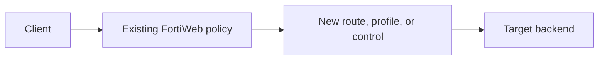

# Lesson NN - <Title>

> Lab status: `<Planned | In progress | Complete>`  
> Documentation status: `<Outline | Draft | Reviewed>`  
> Date completed: `YYYY-MM-DD`  
> Depends on: `<Lesson NN or clean base>`

## 1. Scope

### Objective

State the security, delivery, assessment, or knowledge capability added or covered in this lesson in one paragraph.

### In scope

- `<Capability or control>`
- `<Backend/application change>`
- `<Attack, assessment, or validation family; write "None" when not applicable>`

### Out of scope

- `<Control deliberately deferred or unavailable>`
- `<Earlier working objects that were reused without rebuilding>`

### Completion criteria

- [ ] Known-good traffic reaches the intended backend or assessment target, when applicable.
- [ ] The negative test is detected/blocked, or the assessment execution is recorded, when applicable.
- [ ] The FortiWeb event, scan history, or retained evidence identifies the expected control/workflow.
- [ ] Earlier lesson routes still pass regression tests.
- [ ] Trial/license limitations are recorded honestly.

## 2. Starting state

Describe the last known-good system before making this lesson's changes.

| Existing object/path | Value | Reused or changed? |
| --- | --- | --- |
| VIP | `<IP>` | Reused |
| Virtual server | `<name>` | Reused |
| Server policy | `<name>` | Reused/changed |
| Web Protection Profile | `<name>` | Reused/cloned/changed |
| Existing route/pool | `<name>` | Reused |

### Baseline command

```bash
curl -i -H "Host: <hostname>" http://<vip>/<known-good-path>
```

Expected baseline: `<status, application marker, or response header>`

Observed baseline: `<actual result>`

## 3. Architecture delta

Explain only what this lesson adds or changes.



### Traffic flow

1. `<Client request and hostname>`
2. `<VIP / server policy>`
3. `<Content route or protection attachment>`
4. `<Backend target or WAF action>`

## 4. Backend implementation

Delete this section if the lesson does not add or change a backend.

### Files/services added

| File or service | Listen path/port | Purpose |
| --- | --- | --- |
| `<file>` | `<path or port>` | `<test capability>` |

### Exact setup commands

```bash
# Commands used to create, start, and verify the backend.
<command>
```

### Local backend validation

```bash
curl -i http://127.0.0.1:<port>/<path>
sudo ss -lntp | grep ':<port>'
```

Observed result: `<result>`

## 5. FortiWeb objects, policies, or assessment workflow

List every object created or modified. Use the exact GUI/CLI object name. For a knowledge/assessment lesson, record feature visibility, profile/template/history relationships and explicitly mark uncaptured values.

| Order | Object type | Object name | Critical settings | Attached to |
| ---: | --- | --- | --- | --- |
| 1 | `<Schema/rule/pool/etc.>` | `<exact_name>` | `<host, URL, action, target, port>` | `<parent object>` |
| 2 | `<Policy/group>` | `<exact_name>` | `<members and action>` | `<profile or server policy>` |

### Final attachment chain

```text
<server policy>
  -> <web protection profile>
       -> <policy or signature profile>
            -> <group/rule/schema>
```

### Configuration sequence

1. Create `<lowest-level dependency>`.
2. Add it to `<group or rule>`.
3. Add the rule to `<policy>`.
4. Select the policy inside `<active Web Protection Profile>`.
5. Confirm the profile is selected by `<server policy>`.
6. Save/apply the server policy and retest.

## 6. Test plan

| Test ID | Type | Request | Expected result | Observed result | Evidence |
| --- | --- | --- | --- | --- | --- |
| `NN-01` | Baseline | `<summary>` | Allowed | `<status/action>` | `<link>` |
| `NN-02` | Attack/assessment | `<summary>` | `<Alert/Deny/Completed>` | `<status/action>` | `<link>` |
| `NN-03` | Regression | `<older hostname>` | Allowed | `<status/action>` | `<link>` |

Use three categories:

- Positive control: a legitimate request that must remain allowed
- Negative test: the malformed or malicious request the control should handle
- Regression test: an earlier lesson's path that must remain functional

## 7. Attacks or assessment activity

If the lesson includes no manual attack, say so explicitly and document the authorized assessment workflow instead of creating a placeholder attack.

Record the exact command and exact payload. Do not replace commands with screenshots.

### Attack NN-01 - <Name>

**Purpose:** `<what the request is designed to trigger>`

**Precondition:** `<cookie, token, page load, content type, alert mode, etc.>`

**Exact request:**

```bash
curl -i -X <METHOD> 'http://<hostname>/<path>' \
  -H 'Content-Type: <type>' \
  -H 'Authorization: Bearer <TOKEN>' \
  --data '<exact-payload>'
```

If the payload is clearer separately:

```json
{
  "field": "<value>"
}
```

**Expected result:** `<allowed, logged, challenged, or denied>`

**Observed result:**

- HTTP status: `<status>`
- FortiWeb action: `<alert/deny/etc.>`
- Rule/attack ID: `<identifier>`
- Backend received request: `<yes/no/not checked>`
- Relevant response/log excerpt: `<short excerpt>`

**Evidence:** `evidence/<descriptive-file>`

**Interpretation:** Explain why this proves the FortiWeb control acted, rather than the backend merely rejecting the request.

### Positive control for NN-01

```bash
curl -i <known-good-request>
```

Observed result: `<legitimate traffic remained available>`

> Copy the attack subsection once per distinct payload family. Keep encoded and unencoded variants separate when their outcomes differ.

## 8. Debugging issues and fixes

Preserve failed attempts when they teach something about the data path or attachment chain.

| Symptom | Root cause | Diagnostic evidence | Fix | Retest |
| --- | --- | --- | --- | --- |
| `<no log / 404 / empty reply / false block>` | `<cause>` | `<command or GUI observation>` | `<exact change>` | `<result>` |

### Issue NN-D1 - <Short description>

**Symptom:** `<what was observed>`

**Initial hypothesis:** `<what you checked first>`

**Diagnostics:**

```bash
<exact diagnostic commands>
```

**Root cause:** `<confirmed cause>`

**Fix:** `<exact object, port, target, or attachment changed>`

**Why the fix worked:** `<traffic-chain explanation>`

## 9. Final validated results

### Results matrix

| Capability | Known-good request | Invalid/attack request | Final action | Status |
| --- | --- | --- | --- | --- |
| `<control>` | `<allowed result>` | `<detected/denied result>` | `<action>` | Complete/Partial/Limited |

### Final regression commands

```bash
curl -i http://juice.lab.local/<path>
curl -i http://webgoat.lab.local/<path>
curl -i http://urlenc.lab.local/<path>
curl -i http://api.lab.local/<path>
```

Remove hostnames not yet introduced at this lesson.

### Completion statement

Summarize what now works, what remained unchanged, and any feature that was unavailable or only partially validated.

## 10. Cleanup and rollback

```bash
# Stop only processes/containers introduced by this lesson, if needed.
<command>
```

FortiWeb rollback: `<objects to detach/disable in reverse dependency order>`

Prefer changing a test control from `Alert & Deny` to `Alert` during diagnosis instead of deleting the object chain.

## 11. Lessons learned

- `<Technical insight about FortiWeb or HTTP/API behavior>`
- `<Troubleshooting insight>`
- `<Why positive controls or regression tests mattered>`

## 12. Evidence and references

| Artifact | Description |
| --- | --- |
| `evidence/<file>` | `<what it proves>` |
| `configs/<file>` | `<schema/object/export purpose>` |

### Sanitization check before commit

- [ ] No FortiWeb license data or raw unsanitized appliance export
- [ ] No private keys or real credentials
- [ ] No reusable JWTs, session cookies, or bearer tokens
- [ ] No unrelated personal or management-network information in screenshots
- [ ] Every screenshot has a descriptive filename and caption
- [ ] Every runtime security claim has a command and observed result; assessment claims include target/profile/history/retest evidence or an explicit proof limitation
